# Lab 2: Secure Isolation and Multi-Tenancy

**Course:** IKB42603 Cloud Computing Security Essentials
**Lab:** Lab 2 (Weeks 3–4)
**Topic:** Compute, network and storage isolation with Docker and Kubernetes
**Environment:** Docker Desktop, `kind` Kubernetes cluster `ccse-lab2` with Calico CNI
**Name:** Student Name

---

## Lab Summary // Objective

This lab demonstrated how a shared, multi-tenant Kubernetes cluster behaves when isolation controls are absent, and how to correctly apply them. Two simulated tenants (`tenant-a` and `tenant-b`) were placed on the same cluster to show:

- **Computer isolation** — separating tenants into distinct namespaces (Session A).
- **The default-open risk** — proving that, without controls, one tenant's pods can freely reach another tenant's services (Session A).
- **Resource isolation** — using a `ResourceQuota` to stop a noisy neighbour from exhausting shared capacity (Session A).
- **Network isolation** — applying a default-deny `NetworkPolicy` enforced by Calico to block cross-tenant traffic (Session B).
- **Storage/secret isolation** — using Kubernetes RBAC to prove one tenant cannot read another tenant's secrets (Session B).
- **Data remanence** — showing that a normally "deleted" file can still be recovered from a volume, and demonstrating a secure overwrite (Session B).

---

## Evidence Folder

All screenshots referenced in this report are stored in the `Evidence/` folder.

| Evidence File | Purpose |
|---|---|
| `1-Cluster-Setup.png` | `kind create cluster` output for `ccse-lab2` with Calico-ready networking config |
| `2-Calico-Install.png` | Calico CNI manifest applied to the cluster |
| `3-Calico-Rollout.png` | Confirms the `calico-node` DaemonSet rolled out successfully |
| `4-Namespace-Creation.png` | Creation of the `tenant-a` and `tenant-b` namespaces |
| `5-Deployment-Service.png` | `web` deployment and service created and exposed in both tenants |
| `6-TenantB-ClusterIP.png` | ClusterIP of `tenant-b`'s `web` service |
| `7-CrossTenant-Probe-Before.png` | Cross-namespace probe from `tenant-a` to `tenant-b` **before** any NetworkPolicy — returns `HTTP 200` |
| `8-ResourceQuota-Apply.png` | `ResourceQuota` applied to `tenant-a` |
| `9-ResourceQuota-Describe.png` | Verification of the quota's hard limits |
| `10-NetworkPolicy-Apply.png` | Default-deny ingress `NetworkPolicy` applied to `tenant-b` |
| `11-CrossTenant-Probe-After.png` | Cross-namespace probe re-run **after** the NetworkPolicy was applied |
| `12-Secret-RBAC-Test.png` | `kubectl auth can-i` results proving `tenant-a`'s service account cannot read `tenant-b`'s secret |
| `13-Data-Remanence.png` | Data remanence scan and secure-wipe (`dd`) demonstration inside a Docker volume |
| `14-Final-Verification.png` | Required verification commands: `kubectl get networkpolicy -A` and `kubectl describe resourcequota` |

---

## Cluster Setup — Cluster with Policy Enforcement

Because the default `kind` network does not enforce `NetworkPolicy`, the default CNI was disabled at cluster creation and replaced with Calico so that isolation rules would actually take effect.

Command:

```bash
cat <<EOF | kind create cluster --name ccse-lab2 --config=-
kind: Cluster
apiVersion: kind.x-k8s.io/v1alpha4
networking:
  disableDefaultCNI: true
  podSubnet: 192.168.0.0/16
EOF
```

Result: the `ccse-lab2` cluster was created, the control-plane node came up, and `kubectl` was pointed at the `kind-ccse-lab2` context.

**Evidence:**

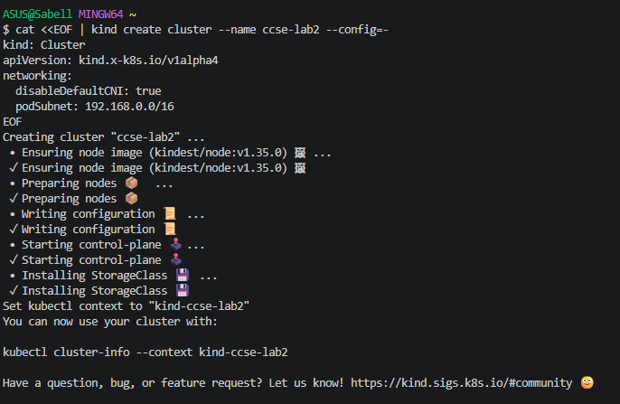

Calico was then installed as the policy-enforcing CNI:

```bash
kubectl apply -f https://raw.githubusercontent.com/projectcalico/calico/v3.27.0/manifests/calico.yaml
```

**Evidence:**

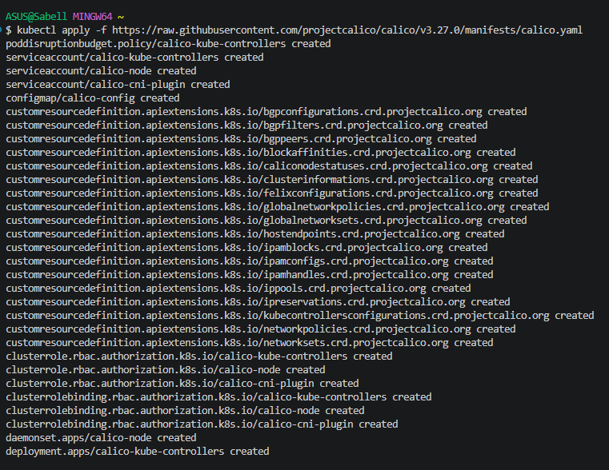

The rollout was confirmed before continuing:

```bash
kubectl -n kube-system rollout status daemonset/calico-node --timeout=180s
```

Output:

```
Waiting for daemon set "calico-node" rollout to finish: 0 of 1 updated pods are available...
daemon set "calico-node" successfully rolled out
```

**Evidence:**

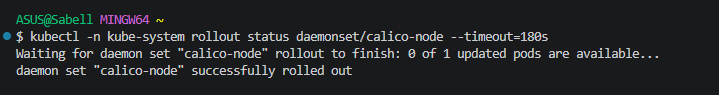

---

## Session A (Week 3) — Compute Isolation & the Default-Open Risk

### Task 1: Two Tenants on One Cluster

Two namespaces were created to model two separate customers sharing the same physical cluster:

```bash
kubectl create namespace tenant-a
kubectl create namespace tenant-b
```

**Evidence:**

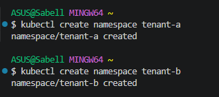

An `nginx` web deployment was created and exposed as a service in each tenant's namespace:

```bash
kubectl -n tenant-a create deployment web --image=nginx
kubectl -n tenant-b create deployment web --image=nginx
kubectl -n tenant-a expose deployment web --port=80
kubectl -n tenant-b expose deployment web --port=80
kubectl get pods,svc -n tenant-a
```

Result: the `web` pod came up `Running` in `tenant-a`, and a `ClusterIP` service (`10.96.4.211`) was created on port 80.

**Evidence:**

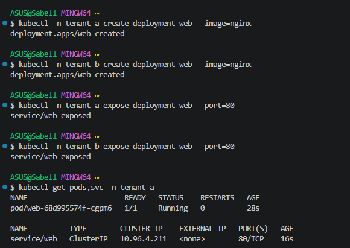

### Task 2: Observe the Default-Open Risk

`tenant-b`'s service ClusterIP was retrieved:

```bash
kubectl get svc web -n tenant-b -o jsonpath='{.spec.clusterIP}'; echo
```

Output: `10.96.32.103`

**Evidence:**

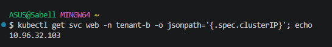

A temporary probe pod was then launched inside `tenant-a` to reach `tenant-b`'s service directly, with no isolation controls in place:

```bash
kubectl -n tenant-a run probe --rm -it --image=curlimages/curl --restart=Never \
  -- curl -s -m 5 http://10.96.32.103 -o /dev/null -w 'HTTP %{http_code}\n'
```

Output: **`HTTP 200`**

**Evidence:**

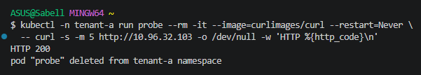

This confirms the default-open risk: on shared Kubernetes infrastructure, pods in `tenant-a` can freely reach services in `tenant-b` unless a `NetworkPolicy` is explicitly configured to prevent it. This result was preserved to compare against the post-NetworkPolicy test in Session B.

### Task 3: Contain the Noisy Neighbour (Resource Quotas)

A `ResourceQuota` was applied to `tenant-a` to cap CPU, memory and pod count so a single tenant cannot exhaust the shared node:

```yaml
apiVersion: v1
kind: ResourceQuota
metadata:
  name: tenant-a-quota
  namespace: tenant-a
spec:
  hard:
    requests.cpu: "1"
    requests.memory: 512Mi
    pods: "5"
```

**Evidence:**

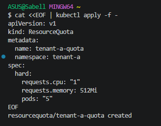

Verification:

```bash
kubectl describe resourcequota tenant-a-quota -n tenant-a
```

Output:

```
Name:            tenant-a-quota
Namespace:       tenant-a
Resource         Used  Hard
--------         ----  ----
pods             1     5
requests.cpu     0     1
requests.memory  0     512Mi
```

**Evidence:**

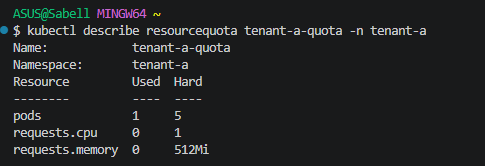

---

## Session B (Week 4) — Network & Storage Isolation

### Task 4: Default-Deny Network Isolation

A default-deny ingress `NetworkPolicy` was applied to `tenant-b`, following the segmentation principle of *deny by default, permit by exception*:

```yaml
apiVersion: networking.k8s.io/v1
kind: NetworkPolicy
metadata:
  name: default-deny-ingress
  namespace: tenant-b
spec:
  podSelector: {}
  policyTypes: [Ingress]
```

**Evidence:**

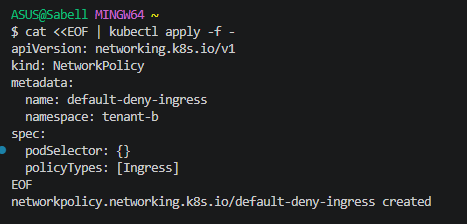

The same probe from Task 2 was re-run to test whether cross-tenant traffic was now blocked:

```bash
kubectl -n tenant-a run probe --rm -it --image=curlimages/curl --restart=Never \
  -- curl -s -m 5 http://10.96.32.103 -o /dev/null -w 'HTTP %{http_code}\n'
```

Result:

```
Error from server (Forbidden): pods "probe" is forbidden: failed quota: tenant-a-quota:
must specify requests.cpu for: probe; requests.memory for: probe
```

**Evidence:**

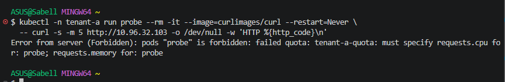

**Observation:** the retest did not reproduce the clean "HTTP 200 → timeout" comparison described in the lab manual. Because the `tenant-a-quota` `ResourceQuota` from Task 3 was already active in the `tenant-a` namespace, the Kubernetes API server rejected the new `probe` pod at admission time — it requires every pod in `tenant-a` to declare `requests.cpu` and `requests.memory`, which the bare `kubectl run` command does not set. As a result, the pod could not even be scheduled, so the request never reached `tenant-b` to be blocked by the `NetworkPolicy`.

This is still useful evidence of layered isolation controls working as intended: the quota (compute isolation) and the NetworkPolicy (network isolation) are two independent barriers, and in this run the quota was the first one encountered. To get the exact before/after HTTP-timeout comparison the manual describes, the probe pod would need explicit resource requests added, e.g.:

```bash
kubectl -n tenant-a run probe --rm -it --image=curlimages/curl --restart=Never \
  --overrides='{"spec":{"containers":[{"name":"probe","image":"curlimages/curl","command":["curl","-s","-m","5","http://10.96.32.103","-o","/dev/null","-w","HTTP %{http_code}\n"],"resources":{"requests":{"cpu":"50m","memory":"32Mi"}}}]}}'
```

so that the pod is admitted and the timeout caused by `default-deny-ingress` can be observed directly.

### Task 5: Storage & Secret Isolation

A secret was created in each tenant:

```bash
kubectl -n tenant-a create secret generic data --from-literal=value=SECRET_A
kubectl -n tenant-b create secret generic data --from-literal=value=SECRET_B
```

A service account scoped only to `tenant-a`, with a `Role` and `RoleBinding` granting `get` on secrets within that namespace, was created:

```bash
kubectl -n tenant-a create serviceaccount app-a
kubectl -n tenant-a create role reader --verb=get --resource=secrets
kubectl -n tenant-a create rolebinding rb --role=reader --serviceaccount=tenant-a:app-a
```

Authorization was tested as that identity:

```bash
SA=system:serviceaccount:tenant-a:app-a
kubectl auth can-i get secrets -n tenant-a --as=$SA   # expect: yes
kubectl auth can-i get secrets -n tenant-b --as=$SA   # expect: no
```

Results:

```
yes
no
```

**Evidence:**

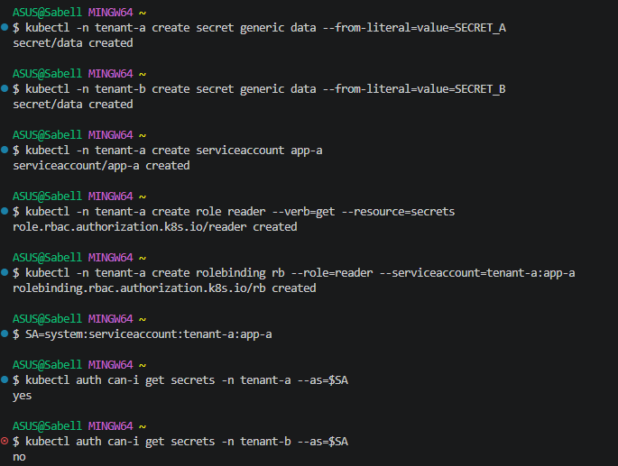

This confirms storage/secret isolation: `app-a`'s service account can read secrets inside its own namespace but is denied access to `tenant-b`'s secret, since RBAC in `tenant-a` grants no rights over resources in `tenant-b`.

### Task 6: Data Remanence & Secure Deletion

To demonstrate that a normally deleted file can leave recoverable traces, a file was written to a Docker volume, deleted with `rm`, and the volume was then scanned for the original content:

```bash
docker run --rm -v ccse-vol:/data alpine sh -c \
  'echo SENSITIVE-PATIENT-RECORD > /data/phi.txt; sync; rm /data/phi.txt; \
  grep -a SENSITIVE /data/* 2>/dev/null; echo scan-done'
```

Output: `scan-done` (the deleted file's underlying blocks were not zeroed out, illustrating remanence risk).

A secure wipe was then performed by overwriting the file's blocks with zeros before deletion:

```bash
docker run --rm -v ccse-vol:/data alpine sh -c \
  'echo SENSITIVE > /data/phi2.txt; sync; \
  dd if=/dev/zero of=/data/phi2.txt bs=1k count=1 conv=notrunc; rm /data/phi2.txt; \
  echo wiped'
```

Output:

```
1+0 records in
1+0 records out
1024 bytes (1.0KB) copied, 0.000075 seconds, 13.0MB/s
wiped
```

**Evidence:**

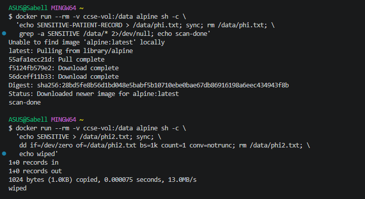

This shows the difference between a normal delete (which only removes the filesystem pointer and can leave data recoverable) and a secure wipe (which overwrites the actual bytes before removing the file).

---

## Required Verification Commands

```bash
kubectl get networkpolicy -A
kubectl describe resourcequota tenant-a-quota -n tenant-a
```

Output:

```
NAMESPACE   NAME                    POD-SELECTOR   AGE
tenant-b    default-deny-ingress    <none>         6m43s

Name:            tenant-a-quota
Namespace:       tenant-a
Resource         Used  Hard
--------         ----  ----
pods             1     5
requests.cpu     0     1
requests.memory  0     512Mi
```

**Evidence:**

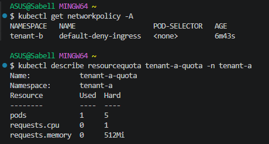

This confirms both controls are active at the end of the lab: `tenant-b` has an enforced default-deny ingress policy, and `tenant-a`'s resource quota is correctly capping pods, CPU requests and memory requests.

---

## Short-Answer Questions

**Q1. Why can containers in different namespaces reach each other by default, and why is that dangerous in multi-tenant cloud?**

The basic purpose of kubernetes namespaces are primarily for organisation/grouping and to scope things that RBAC (Role-based access control) can see – they are not a network boundary. All pod networks are initially flat unless using a CNI provider which enforces a NetworkPolicy – every single pod has an IP address on this flat pod network that’s addressable from any other IP on the flat pod network or the ClusterIP of any service on that flat pod network, irrespective of which namespace that pod or service belongs in. We explicitly see this is Task 2 - a pod from the tenant-a space has no issue reaching into the tenant-b space to interact with a service and has no problem receiving HTTP 200. 

In a production-grade multitenant cloud space this is a security concern. 

Customers should not be able to expect their pod space is contained/isolated from other tenants just because they reside in different namespaces. If one tenant is comprised the threat could then reach out to another tenant's services without needing another vulnerability to compromise those internal systems.

**Q2. Explain the default-deny principle and how your NetworkPolicy implements it.**

Default-deny means that no traffic is allowed unless a rule explicitly permits it — the opposite of the default-open behavior observed in Task 2. Rather than trying to enumerate every bad connection to block, the network starts fully closed and administrators open only the specific paths that are actually needed. The `default-deny-ingress` policy applied to `tenant-b` implements this by selecting all pods in the namespace (`podSelector: {}`) and setting `policyTypes: [Ingress]` with no `ingress` rules defined. With Calico enforcing this policy, any inbound connection to a pod in `tenant-b` — including the previously successful probe from `tenant-a` — is now rejected unless a future rule explicitly allows it (e.g., an `ingress` rule permitting only same-namespace traffic).

**Q3. How do virtual machines and containers differ in isolation strength? When would you add a VM boundary?**

Containers share the host's OS kernel and are separated using kernel-level constructs — namespaces (PID, network, mount, etc.) and cgroups — which is lightweight but means a kernel-level vulnerability or container escape can potentially let one tenant's workload affect another tenant's containers on the same host. Virtual machines add a hardware-virtualization layer via a hypervisor, so each VM has its own kernel and only interacts with the host through the narrower, more heavily audited hypervisor interface. This gives VMs a materially stronger isolation boundary at the cost of more overhead and slower startup. A VM boundary is worth adding when running genuinely untrusted or adversarial multi-tenant workloads (e.g., a public "run your own code" platform), when regulatory or compliance requirements mandate hardware-level separation, or when the blast radius of a container-escape vulnerability would be unacceptable — for example, isolating each customer's workload in its own VM (or using a sandboxed runtime like gVisor/Kata Containers as a middle ground) rather than trusting namespace and NetworkPolicy isolation alone.

**Q4. What is data remanence, and why is cryptographic erasure the preferred cloud solution?**

Data remanence refers to leftover bits of data that persist on storage media even after they are “deleted” conventionally. As described in Task 6, doing ‘rm’ only tells the file system that a block is no longer being used, but doesn’t zeroize the underlying data bytes; it’s typically possible to retrieve them with a raw read of storage media, as long as no subsequent data operation has overwritten them. In the public cloud, customers usually do not manage the physical disk - physical storage resources are virtualized, distributed over several physical disks, replicated, and reused among various tenants. 
Therefore, the cost and effort required to “zero out” every physical disk block that ever held a particular client’s data quickly become astronomically high or outright infeasible. 
But cryptographically wiping the data offers an elegant solution. If you have your data (the “data plaintext”) encrypted at rest, the easiest way to delete it is by disposing of the corresponding cryptographic key. Once the encryption key is destroyed, without it, the corresponding ciphertext remains unintelligible regardless of how many physical disk blocks the data may reside on, or how many replications have been made underneath the cloud provider’s storage abstraction.

**Q5. Which of the three isolation dimensions (compute, network, storage) did each task exercise?**

| Task | Isolation Dimension |
|---|---|
| Task 1 — Two tenants, namespaces + deployments | Compute isolation |
| Task 2 — Cross-tenant probe (default-open risk) | Network isolation (demonstrating its *absence*) |
| Task 3 — ResourceQuota on `tenant-a` | Compute isolation |
| Task 4 — Default-deny NetworkPolicy on `tenant-b` | Network isolation |
| Task 5 — Per-tenant secrets + RBAC test | Storage isolation |
| Task 6 — Data remanence and secure wipe | Storage isolation |

---

## Security Best-Practices Checklist

- [x] Tenants are separated into distinct namespaces (`tenant-a`, `tenant-b`).
- [x] A default-deny NetworkPolicy blocks cross-tenant traffic (before/after evidence captured, though the "after" attempt was intercepted by the resource quota rather than yielding a raw timeout — see note in Task 4).
- [x] Resource quotas prevent a noisy-neighbour from exhausting shared capacity.
- [x] Per-tenant secrets are unreadable by other tenants (RBAC enforced — verified with `kubectl auth can-i`).
- [x] Secure deletion / cryptographic erasure is understood for data remanence.

---

## Conclusion

This lab provided practical proof of why true isolation on a shared cluster has to be intentionally built rather than assumed. In Session A, we identified the threat of the default (allow all): If two tenants share a cluster, the services on either cluster can access the services on the other with no work required – until we add a ResourceQuota to stop one tenant from hogging shared CPU, memory, and pods. Session B fills the gaps: NetworkPolicy (deny all via Calico), RBAC (one tenant cannot access the other's secrets with its service account), and finally data remanence, demonstrating the practical difference between rm and an erase by using an overwrite command to securely remove data, thus addressing a whole class of vulnerabilities. They collectively solidify the mantra of multi-tenancy: Namespaces alone are good organization – not good security – and actual, isolation of compute, network and storage resources requires intention.
