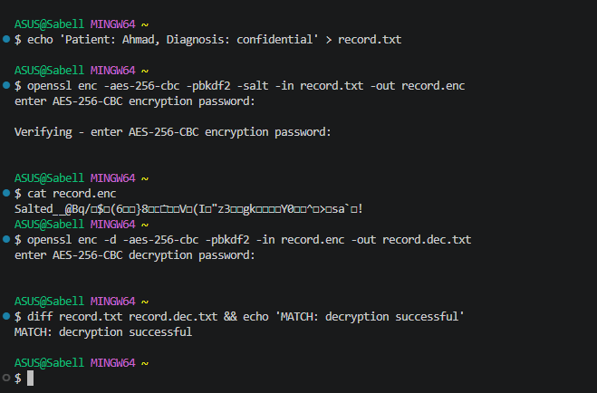
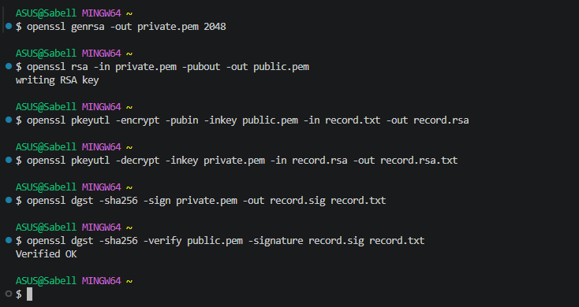
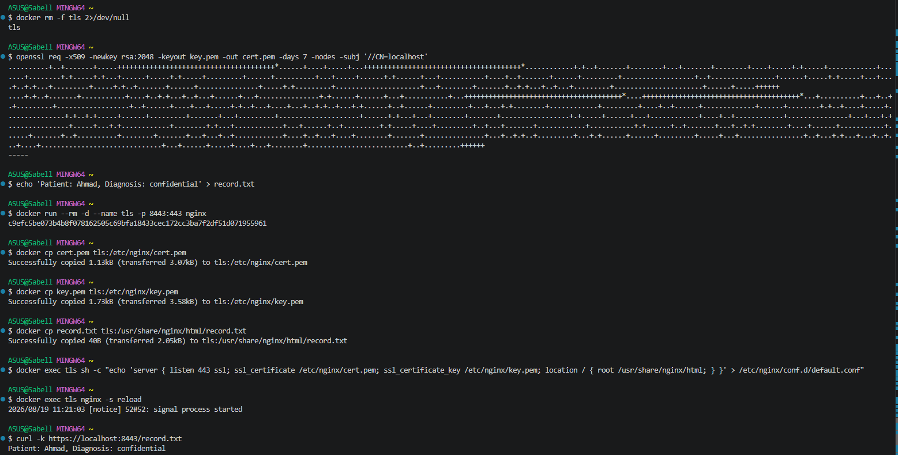
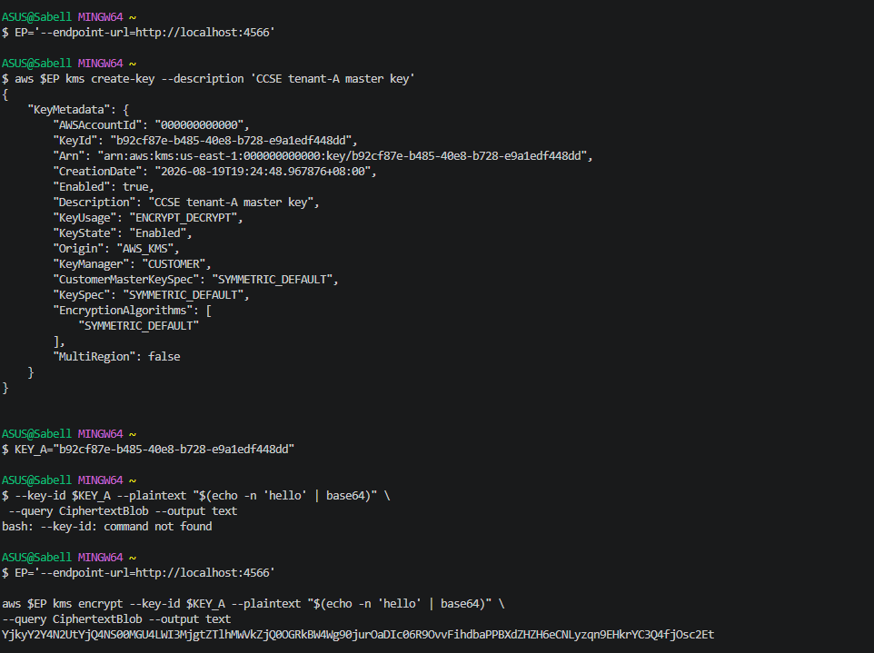
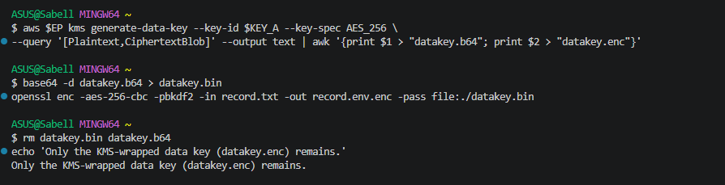
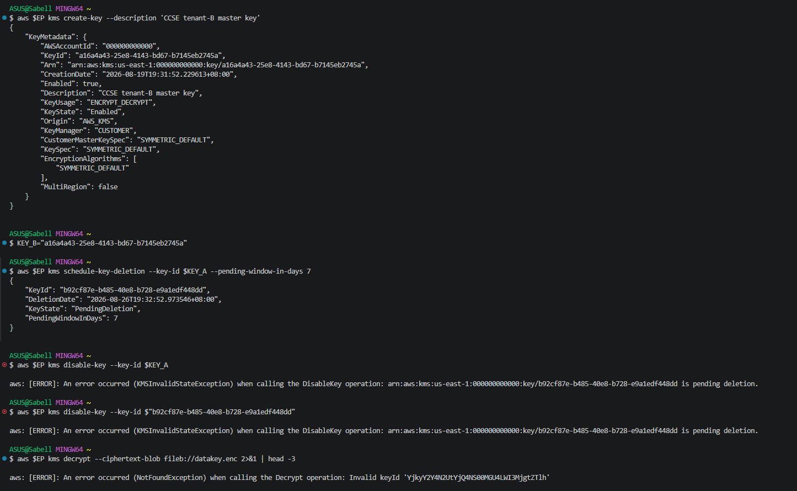
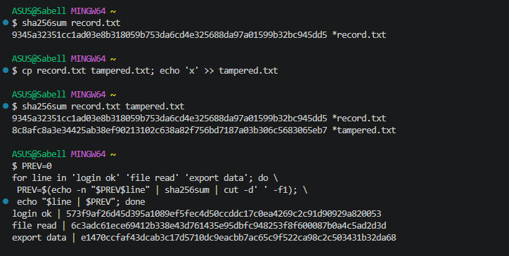

# Lab 3: Data Protection — Encryption & Key Management

## Course Information

| Item | Details |
|---|---|
| **Course Name** | IKB42603 Cloud Computing Security Essentials |
| **Instructor** | Madam Adani |
| **Student Name** | Tuan Syabil Syahmi Bin tuan Mohd Sazli |
| **Topic** | Data protection using encryption, TLS, key management, cryptographic erasure and hashing |
| **Environment** | OpenSSL, Docker, Nginx, AWS CLI and LocalStack KMS |
| **Date** | 18 August 2026 |

---

## Lab Objectives

The objectives of this lab are:

- To encrypt and decrypt data using symmetric and asymmetric encryption.
- To protect data in transit using TLS.
- To manage encryption keys using LocalStack KMS.
- To implement envelope encryption and per-tenant keys.
- To demonstrate cryptographic erasure.
- To verify data integrity using SHA-256 hashing and a hash chain.

## Learning Outcomes

After completing this lab, I was able to:

- Encrypt and decrypt data using AES symmetric encryption.
- Generate and use RSA public and private keys.
- Create and verify a digital signature.
- Protect data in transit using TLS.
- Create and manage encryption keys using LocalStack KMS.
- Apply envelope encryption using a KMS master key and a data key.
- Use separate encryption keys for different tenants.
- Demonstrate cryptographic erasure by scheduling an encryption key for deletion.
- Verify file integrity using SHA-256 hashing.
- Create a simple hash chain for tamper-evident records.

## Environment

| Component | Details |
|---|---|
| Operating System | Kali Linux |
| Cryptographic Tool | OpenSSL 3.5.5 |
| Container Platform | Docker |
| Web Server | Nginx |
| TLS Port | `8443` |
| Command-Line Tool | curl |
| Cloud Service Emulator | LocalStack |
| Key Management Service | LocalStack KMS |
| Cloud Command-Line Tool | AWS CLI v2 |
| Symmetric Encryption | AES-256-CBC |
| Asymmetric Encryption | RSA 2048-bit |
| Hashing Algorithm | SHA-256 |
| Working Directory | `~/Lab3` |

## Lab Summary

In this experiment, AES and RSA encryption were used to encrypt and decrypt a sensitive file. TLS was used to secure the file while it was being transmitted, and a digital signature was produced and validated. Envelope encryption and key creation and management were done using LocalStack KMS. Additionally, distinct keys were made for each tenant, and the timing of a key's deletion served as an example of cryptographic erasure. Finally, a hash chain and SHA-256 hashing were employed to verify data integrity and identify modifications. All things considered, this lab showed how hashing, encryption, and key management can safeguard cloud data.

---

## Step-by-Step Implementation

### Task 1: Symmetric Encryption (Data at Rest)

AES-256-CBC was used to construct and encrypt a sensitive patient record. The file was encrypted and decrypted using the same passphrase.

**1. Create a Sensitive Record**

```bash
echo 'Patient: Ahmad, Diagnosis: confidential' > record.txt
```

**2. Encrypt the Record**

The file was encrypted using AES-256-CBC with PBKDF2 and salt:

```bash
openssl enc -aes-256-cbc -pbkdf2 -salt \
-in record.txt -out record.enc
```

The encrypted file was displayed using:

```bash
cat record.enc
```

The output appeared unreadable, showing that the original content was protected.

**3. Decrypt and Verify the Record**

The encrypted file was decrypted using the same passphrase:

```bash
openssl enc -d -aes-256-cbc -pbkdf2 \
-in record.enc -out record.dec.txt
```

The original and decrypted files were then compared:

```bash
diff record.txt record.dec.txt && echo 'MATCH: decryption successful'
```

The `MATCH: decryption successful` message confirmed that the decrypted content was the same as the original record.



**Figure 1:** AES-256 encryption and decryption showing that the decrypted file matched the original file.

**Result:** The sensitive record was successfully encrypted and decrypted using AES-256-CBC. The encrypted content could not be read normally, while the decrypted file matched the original record.

---

### Task 2: Asymmetric Encryption and Digital Signatures

In this task, an RSA public and private key pair was generated. The public key was used for encryption, while the private key was used for decryption. A digital signature was also created and verified.

**Generate the RSA Key Pair**

```bash
openssl genrsa -out private.pem 2048
openssl rsa -in private.pem -pubout -out public.pem
```

**Encrypt and Decrypt the Record**

```bash
openssl pkeyutl -encrypt -pubin -inkey public.pem \
-in record.txt -out record.rsa

openssl pkeyutl -decrypt -inkey private.pem \
-in record.rsa -out record.rsa.txt
```

**Create and Verify the Digital Signature**

```bash
openssl dgst -sha256 -sign private.pem \
-out record.sig record.txt

openssl dgst -sha256 -verify public.pem \
-signature record.sig record.txt
```

The `Verified OK` output confirmed that the digital signature was valid and that the record had not been modified.



**Figure 2:** RSA encryption, decryption and digital-signature verification showing the `Verified OK` result.

**Result:** The record was successfully protected using RSA encryption. The digital signature was also verified successfully, confirming the origin and integrity of the record.

---

### Task 3: Encryption in Transit (TLS)

In this task, TLS was used to protect the sensitive record while it was transmitted through an HTTPS connection. A self-signed certificate and an RSA private key were generated using OpenSSL.

**Generate a Self-Signed Certificate**

```bash
openssl req -x509 -newkey rsa:2048 \
-keyout key.pem -out cert.pem \
-days 7 -nodes -subj '/CN=localhost'
```

This command created a certificate named `cert.pem` and a private key named `key.pem`.

**Configure Nginx for TLS**

The default Nginx container did not automatically enable TLS after the certificate and private key were mounted, so the certificate, key and sensitive record were copied into the running container and an inline SSL configuration was applied before reloading Nginx.

**Run the HTTPS Container and Access the Record**

```bash
docker run --rm -d --name tls -p 8443:443 nginx

docker cp cert.pem tls:/etc/nginx/cert.pem
docker cp key.pem tls:/etc/nginx/key.pem
docker cp record.txt tls:/usr/share/nginx/html/record.txt

docker exec tls sh -c "echo 'server { listen 443 ssl; ssl_certificate /etc/nginx/cert.pem; ssl_certificate_key /etc/nginx/key.pem; location / { root /usr/share/nginx/html; } }' > /etc/nginx/conf.d/default.conf"

docker exec tls nginx -s reload

curl -k https://localhost:8443/record.txt
```

The command returned:

```text
Patient: Ahmad, Diagnosis: confidential
```

After the HTTPS connection was tested successfully, the TLS container was stopped:

```bash
docker stop tls
```



**Figure 3:** Generation of the self-signed TLS certificate, configuration of the Nginx container, and successful retrieval of the sensitive record over HTTPS.

**Result:** The sensitive record was successfully transmitted through an HTTPS connection. TLS encrypted the communication channel and protected the data from being read if the network traffic was intercepted. The TLS container was then stopped successfully after the test was completed.

---

### Task 4: Create and Use a KMS Master Key

In this task, LocalStack KMS was used to create a customer master key for Tenant A. The key was then used to encrypt a small secret directly.

**Start LocalStack KMS**

```bash
docker run --rm -d --name localstack \
-p 4566:4566 \
-e SERVICES=kms \
localstack/localstack:3.0

EP='--endpoint-url=http://localhost:4566'
```

**Create a Master Key for Tenant A**

```bash
aws $EP kms create-key \
--description 'CCSE tenant-A master key'
```

The command returned the KMS key information, including the KeyId, description and key status. The output showed that the key was enabled and could be used for encryption and decryption.

**Store the KMS KeyId**

```bash
KEY_A=b92cf87e-b485-40e8-b728-e9a1edf448dd
echo $KEY_A
```

**Encrypt a Small Secret**

```bash
aws $EP kms encrypt \
--key-id $KEY_A \
--plaintext "$(echo -n 'hello' | base64)" \
--query CiphertextBlob \
--output text
```

The command returned a long Base64 ciphertext, showing that the secret was successfully encrypted.



**Figure 4:** Creation of a KMS master key for Tenant A using LocalStack, and direct encryption of the `hello` secret using that key.

**Result:** A KMS master key was successfully created for Tenant A using LocalStack. The key was enabled and used to encrypt a small secret directly. This demonstrated how a Key Management Service can centrally create and manage encryption keys.

---

### Task 5: Envelope Encryption

In this task, envelope encryption was used to protect the sensitive record. KMS generated a plaintext data key and a wrapped copy of the same key. The plaintext key was used to encrypt the record locally, while the wrapped key was kept for future decryption.

**Generate the Data Key**

```bash
aws $EP kms generate-data-key \
--key-id $KEY_A \
--key-spec AES_256 \
--query '[Plaintext,CiphertextBlob]' \
--output text | awk '{print $1 > "datakey.b64"; print $2 > "datakey.enc"}'
```

**Encrypt the Sensitive Record**

The plaintext data key was decoded and used to encrypt the sensitive record locally:

```bash
base64 -d datakey.b64 > datakey.bin

openssl enc -aes-256-cbc -pbkdf2 \
-in record.txt -out record.env.enc \
-pass file:./datakey.bin
```

**Remove the Plaintext Data Key**

```bash
rm datakey.bin datakey.b64
echo 'Only the KMS-wrapped data key (datakey.enc) remains.'
```



**Figure 5:** Envelope encryption of the sensitive record and removal of the plaintext data key, leaving only the KMS-wrapped key.

**Result:** The sensitive record was successfully encrypted using a data key generated by KMS. The plaintext data key was removed after use, while only the wrapped data key remained. This reduced the risk of exposing the plaintext key and demonstrated the envelope-encryption process.

---

### Task 6: Per-Tenant Keys and Cryptographic Erasure

In this task, a separate KMS master key was created for Tenant B. The Tenant A key was then scheduled for deletion to demonstrate cryptographic erasure.

**Create a Separate Key for Tenant B**

```bash
aws $EP kms create-key \
--description 'CCSE tenant-B master key'

KEY_B=a16a4a43-25e8-4143-bd67-b7145eb2745a

echo "Tenant A: $KEY_A"
echo "Tenant B: $KEY_B"
```

The output confirmed that each tenant used a different KMS master key.

**Schedule the Tenant A Key for Deletion**

```bash
aws $EP kms schedule-key-deletion \
--key-id $KEY_A \
--pending-window-in-days 7
```

The output showed that the Tenant A key had entered the `PendingDeletion` state.

**Attempt to Disable the Tenant A Key**

```bash
aws $EP kms disable-key --key-id $KEY_A
```

KMS returned a `KMSInvalidStateException` because the key was already pending deletion. A key in this state cannot be disabled or used for cryptographic operations.

**Test Cryptographic Erasure**

```bash
aws $EP kms decrypt \
--ciphertext-blob fileb://datakey.enc 2>&1 | head -3
```

The decrypt operation failed because the Tenant A master key was pending deletion, confirming that the wrapped data key could no longer be unwrapped.



**Figure 6:** Separate KMS master keys created for Tenant A and Tenant B; the Tenant A key entered the `PendingDeletion` state, causing the disable and decrypt operations to fail.

**Result:** Separate KMS master keys were successfully created for Tenant A and Tenant B. After the Tenant A key was scheduled for deletion, its wrapped data key could no longer be decrypted. Therefore, the encrypted Tenant A record became unrecoverable even though the encrypted file still existed. This demonstrated cryptographic erasure and the benefit of using separate encryption keys for each tenant.

---

### Task 7: Integrity and Tamper-Evidence

In this task, SHA-256 hashing was used to verify file integrity and detect changes. A simple hash chain was also created to demonstrate a tamper-evident log.

**Generate the Original File Hash**

```bash
sha256sum record.txt
```

**Tamper with a Copy of the Record**

```bash
cp record.txt tampered.txt
echo 'x' >> tampered.txt

sha256sum record.txt tampered.txt
```

The output showed different SHA-256 hashes for `record.txt` and `tampered.txt`. This confirmed that even a small change to the file could be detected using hashing.

**Create a Hash Chain**

```bash
PREV=0
for line in 'login ok' 'file read' 'export data'; do \
PREV=$(echo -n "$PREV$line" | sha256sum | cut -d' ' -f1); \
echo "$line | $PREV"; done
```

Each new hash was calculated using the previous hash together with the current log entry. This linked the records together in sequence.



**Figure 7:** SHA-256 detected the modification to the copied record, while the hash chain created linked and tamper-evident log entries.

**Result:** The original and altered files' SHA-256 hashes differed, demonstrating that hashing can identify unauthorized modifications. Every log entry was connected to the prior hash by the hash chain. If a previous entry were altered, its hash and all subsequent hashes would change, making the tampering obvious.

---

## Verification Commands

The LocalStack KMS keys can be verified using:

```bash
aws --endpoint-url=http://localhost:4566 kms list-keys
```

The RSA digital signature can be verified using:

```bash
openssl dgst -sha256 -verify public.pem -signature record.sig record.txt
```

---

## Evidence

All screenshots used as evidence are stored in the `Evidence` folder.

| Screenshot | Description |
|---|---|
| `1-AES-Encryption-Decryption.png` | AES-256 encryption and successful decryption verification (Task 1) |
| `2-RSA-Digital-Signature.png` | RSA encryption, decryption and digital-signature verification (Task 2) |
| `3-TLS-HTTPS-Connection.png` | Self-signed TLS certificate generation and successful HTTPS connection (Task 3) |
| `4-KMS-Master-Key-and-Encryption.png` | Creation of the Tenant A KMS master key and direct encryption of a secret (Task 4) |
| `5-Envelope-Encryption-and-Key-Removal.png` | Envelope encryption and removal of the plaintext data key (Task 5) |
| `6-Per-Tenant-Keys-and-Cryptographic-Erasure.png` | Separate KMS master keys for Tenant A and Tenant B; failed decryption after erasure (Task 6) |
| `7-Integrity-and-Tamper-Evidence.png` | SHA-256 tamper detection and tamper-evident hash chain (Task 7) |

## Commands Used

| Purpose | Command |
|---|---|
| Encrypt a file using AES-256 | `openssl enc -aes-256-cbc -pbkdf2 -salt -in record.txt -out record.enc` |
| Decrypt the AES-encrypted file | `openssl enc -d -aes-256-cbc -pbkdf2 -in record.enc -out record.dec.txt` |
| Generate an RSA private key | `openssl genrsa -out private.pem 2048` |
| Verify a digital signature | `openssl dgst -sha256 -verify public.pem -signature record.sig record.txt` |
| Generate a self-signed TLS certificate | `openssl req -x509 -newkey rsa:2048 -keyout key.pem -out cert.pem -days 7 -nodes -subj '/CN=localhost'` |
| Access the record through HTTPS | `curl -k https://localhost:8443/record.txt` |
| Create a KMS master key | `aws $EP kms create-key --description 'CCSE tenant-A master key'` |
| Generate an AES-256 data key | `aws $EP kms generate-data-key --key-id $KEY_A --key-spec AES_256` |
| Encrypt the record using the data key | `openssl enc -aes-256-cbc -pbkdf2 -in record.txt -out record.env.enc -pass file:./datakey.bin` |
| Schedule cryptographic erasure | `aws $EP kms schedule-key-deletion --key-id $KEY_A --pending-window-in-days 7` |
| Test data-key decryption after erasure | `aws $EP kms decrypt --ciphertext-blob fileb://datakey.enc` |
| Compare file hashes | `sha256sum record.txt tampered.txt` |

## Challenges Encountered

- The Nginx container did not enable TLS by default after the certificate and key files were mounted, which was solved by copying the files into the running container and applying an inline SSL configuration before reloading Nginx.
- The existing LocalStack container required a license token. LocalStack Community version 3.0 was used instead.
- The Tenant A key could not be disabled because it was already pending deletion. However, the decryption attempt still failed as expected, confirming the erasure.

---

## Short-Answer Questions

### Q1. Compare symmetric and asymmetric encryption: speed, key distribution and typical use.

Symmetric encryption uses the same key for both encryption and decryption, which makes it computationally fast and efficient, especially for large amounts of data. Its main weakness is key distribution — the same secret key must be shared safely between the sender and receiver, and if it is intercepted, the data can be exposed. It is typically used to protect stored data (data at rest) and bulk file encryption, as demonstrated with AES-256 in Task 1.

Asymmetric encryption uses a mathematically linked key pair — a public key and a private key. The public key can be shared openly and used for encryption or signature verification, while the private key is kept secret and used for decryption or signing. This removes the need to share a secret key, but it is significantly slower and more computationally expensive than symmetric encryption. Because of this, it is typically used for key exchange, digital signatures, and authentication rather than for encrypting large volumes of data directly, as shown with RSA in Task 2.

### Q2. Why is key management described as the weakest link, not the algorithm?

Modern encryption algorithms such as AES-256 and RSA-2048 are mathematically very strong and, when implemented correctly, are practically infeasible to break by brute force. However, encrypted data is only as safe as the key that protects it. If a key is weakly generated, stored insecurely, shared carelessly, never rotated, or leaked, an attacker does not need to break the algorithm at all — they can simply use the exposed key to decrypt the data directly. Task 5 and Task 6 illustrated this: the plaintext data key was deliberately deleted from disk after use, and access to Tenant A's data was lost entirely once its master key was scheduled for deletion. This shows that protecting, storing, and controlling access to keys is generally the harder and more critical problem, which is why key management — not the choice of algorithm — is considered the weakest link in a cryptographic system.

### Q3. Explain envelope encryption and why only the master key needs hardware-grade protection.

Envelope encryption is a two-layer encryption scheme. First, a data key is generated and used to encrypt the actual data locally (as done with `record.txt` in Task 5, using `datakey.bin`). Second, that data key itself is encrypted ("wrapped") by a separate master key that is held and managed inside the KMS. The result is that the data is protected by the data key, and the data key is protected by the master key.

Only the master key needs hardware-grade protection (such as being kept inside an HSM or a secure KMS boundary) because the master key never leaves the KMS and is the single point that must remain secure — everything else derives its protection from it. The plaintext data key, by contrast, is only ever needed briefly and in memory to encrypt or decrypt the data, after which it is discarded (as shown when `datakey.bin` and `datakey.b64` were deleted in Task 5). This design allows large volumes of data to be encrypted efficiently with ordinary data keys, while concentrating the strongest security controls on the small number of master keys that matter most.

### Q4. How does cryptographic erasure achieve provable deletion where overwriting cannot (in the cloud)?

In a cloud environment, data is often duplicated across multiple disks, replicas, snapshots, and backups, so it is very difficult to guarantee that every physical copy of a file has been located and securely overwritten. Overwriting therefore cannot reliably prove that all copies of the data have been destroyed.

Cryptographic erasure solves this differently: instead of trying to erase every copy of the ciphertext, it destroys or disables the encryption key that protects the data. As demonstrated in Task 6, once the Tenant A master key was scheduled for deletion, the wrapped data key could no longer be decrypted (`kms decrypt` failed with a `KMSInvalidStateException`), and any remaining copies of `record.env.enc` became permanently unreadable even though the ciphertext files themselves still physically existed. Because there is only one key (or a small number of keys) to destroy, rather than an unknown number of data copies, deletion becomes fast, verifiable, and provable — the provider or auditor only needs to confirm that the key is gone.

### Q5. How does a hash chain make a log tamper-evident (link to tamper-proof logs, Week 6)?

In a hash chain, each new log entry's hash is calculated from both the current entry's content and the hash of the previous entry, linking every record to the one before it in sequence. This was demonstrated in Task 7, where the entries `login ok`, `file read`, and `export data` were each hashed together with the running `PREV` value from the prior step.

Because each hash depends on the one before it, changing or deleting any single entry in the chain — even far in the past — will produce a completely different hash for that entry, which in turn changes every subsequent hash in the chain. This makes any tampering immediately detectable: an attacker cannot silently modify one log entry without breaking the chain of hashes that follows it, unless they recompute the entire chain from that point forward, which is what makes hash-chained logs "tamper-evident" rather than just tamper-resistant.

---

## Security Best-Practices Checklist

- [x] Data encrypted at rest using AES and decryption verified.
- [x] Asymmetric keys used correctly by encrypting with the public key and signing with the private key.
- [x] Data protected in transit using TLS.
- [x] Envelope encryption used, and the plaintext data key was removed from disk.
- [x] Per-tenant keys used, and cryptographic erasure demonstrated.
- [x] Data integrity verified using SHA-256 hashing and a hash chain.

## Cleanup and Teardown

After completing the lab and saving all evidence, the temporary cryptographic files, keys and containers were removed.

```bash
docker stop tls 2>/dev/null
rm -f record.* private.pem public.pem key.pem cert.pem datakey.* tampered.txt
docker stop localstack
```

The directory and Docker containers were checked after the cleanup to confirm that the sensitive records, cryptographic keys and temporary data-key files had been removed, and that the LocalStack container used for the KMS tasks had been stopped.

## Conclusion

Digital signatures, TLS, and AES and RSA encryption were used in this experiment to protect data. Envelope encryption, cryptographic erasure, and independent key management were all done with LocalStack KMS. To identify changes and safeguard data integrity, a hash chain and SHA-256 hashing were also employed. Overall, this lab showed how cloud data may be protected both in transit and at rest using encryption, key management, and integrity controls.

## References

1. UniKL MIIT. (2026). *IKB42603 Cloud Computing Security Essentials: Lab 3 - Data Protection, Encryption and Key Management*.
2. OpenSSL Project. (n.d.). *OpenSSL encryption documentation*. [https://docs.openssl.org/3.3/man1/openssl-enc/](https://docs.openssl.org/3.3/man1/openssl-enc/)
3. Amazon Web Services. (n.d.). *AWS Key Management Service*. [https://docs.aws.amazon.com/kms/latest/developerguide/overview.html](https://docs.aws.amazon.com/kms/latest/developerguide/overview.html)
4. Amazon Web Services. (n.d.). *AWS KMS cryptography essentials and envelope encryption*. [https://docs.aws.amazon.com/kms/latest/developerguide/kms-cryptography.html](https://docs.aws.amazon.com/kms/latest/developerguide/kms-cryptography.html)
