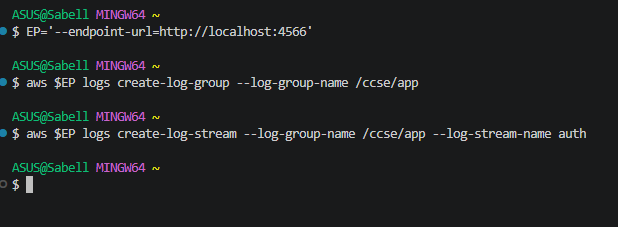
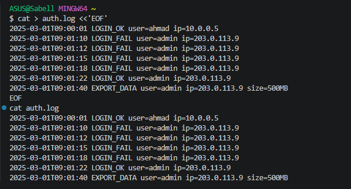
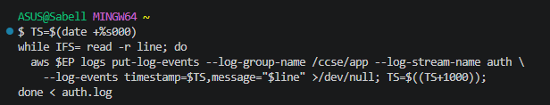
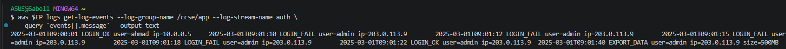
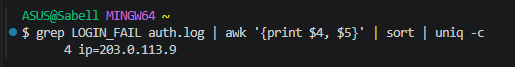
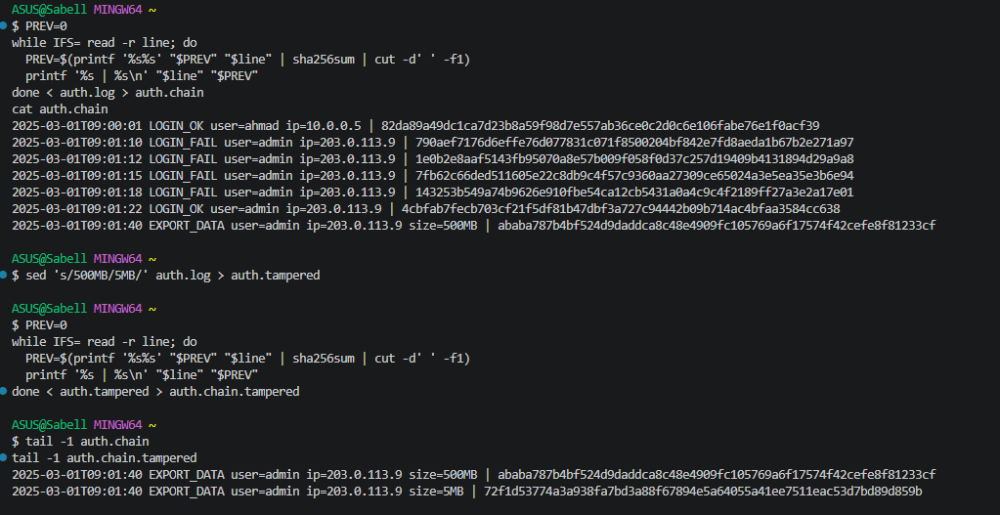
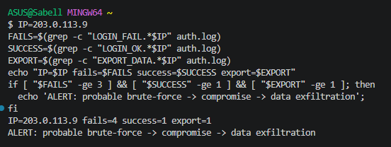
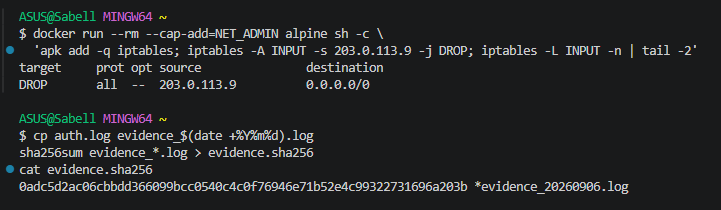
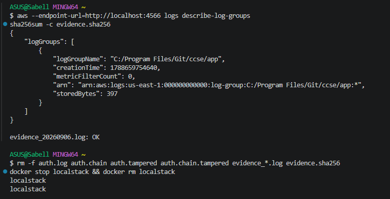

# Lab 5: Monitoring, Logging and Incident Detection

**Course:** IKB42603 Cloud Computing Security Essentials
**Lab:** Lab 5
**Topic:** Centralised logging, tamper-evident logs, incident detection and incident response
**Environment:** Docker, LocalStack, AWS CLI, CloudWatch Logs, grep, awk, sha256sum and iptables
**Name:** Student Name

## Lab Summary

This lab demonstrates how logs support cloud security monitoring and incident response. Application authentication logs were generated, shipped to a central CloudWatch Logs service in LocalStack, queried for failed logins, protected with a SHA-256 hash chain, and correlated to detect a probable brute-force compromise followed by data exfiltration.

The main security lesson is that prevention alone is not enough. Centralised logging gives visibility, tamper-evident logs protect audit integrity, correlation turns separate log lines into a meaningful incident, and response actions help contain the attacker while preserving evidence.

## Evidence Folder

All screenshots used for this report are stored in the `Evidence` folder.

| Evidence File | Purpose |
|---|---|
| `0-Localstack.png` | LocalStack endpoint configured and CloudWatch Logs group/stream created |
| `1-App-Logs.png` | `auth.log` created with login and data export events |
| `2-Centralise-Logs.png` | Log events uploaded to CloudWatch Logs using `put-log-events` |
| `2.1-read-event.png` | Centralised log events read back using `get-log-events` |
| `3-query.png` | Failed login count grouped by IP |
| `4-Tamper-Proof.png` | SHA-256 hash chain created and tampered log generated |
| `5.Correlation.png` | Correlation rule detected brute force, compromise and data export pattern |
| `6-Incident_Response.png` | Attacker IP blocked and evidence hash file created |
| `7-Verification.png` | Log group verification, evidence hash check, and cleanup |

## Session A: Logging and Centralisation

### Setup: Start LocalStack and Create Log Storage

LocalStack was used to simulate AWS CloudWatch Logs locally:

```bash
docker run -d --name localstack -p 4566:4566 localstack/localstack
EP='--endpoint-url=http://localhost:4566'
```

A CloudWatch Logs log group and log stream were created:

```bash
aws $EP logs create-log-group --log-group-name /ccse/app
aws $EP logs create-log-stream --log-group-name /ccse/app --log-stream-name auth
```

**Result:** The log group `/ccse/app` acts as the central container for application logs, and the `auth` stream stores authentication-related events. Both commands returned no errors, confirming the resources were created successfully.

**Evidence:** 

### Task 1: Generate Application Logs

An authentication log file was created:

```bash
cat > auth.log <<'EOF'
2025-03-01T09:00:01 LOGIN_OK user=ahmad ip=10.0.0.5
2025-03-01T09:01:10 LOGIN_FAIL user=admin ip=203.0.113.9
2025-03-01T09:01:12 LOGIN_FAIL user=admin ip=203.0.113.9
2025-03-01T09:01:15 LOGIN_FAIL user=admin ip=203.0.113.9
2025-03-01T09:01:18 LOGIN_FAIL user=admin ip=203.0.113.9
2025-03-01T09:01:22 LOGIN_OK user=admin ip=203.0.113.9
2025-03-01T09:01:40 EXPORT_DATA user=admin ip=203.0.113.9 size=500MB
EOF
cat auth.log
```

Observed activity:

- User `ahmad` logged in successfully from `10.0.0.5`.
- User `admin` had four failed login attempts from `203.0.113.9`.
- The same `admin` account later logged in successfully from `203.0.113.9`.
- The same IP then performed `EXPORT_DATA` with `size=500MB`.

**Result:** The log file created a realistic incident trail showing repeated failed authentication followed by successful access and a large data export.

**Evidence:** 

### Task 2: Centralise Logs

Each line from `auth.log` was uploaded to CloudWatch Logs:

```bash
TS=$(date +%s000)
while IFS= read -r line; do
  aws $EP logs put-log-events --log-group-name /ccse/app --log-stream-name auth \
    --log-events timestamp=$TS,message="$line" >/dev/null
  TS=$((TS+1000))
done < auth.log
```

**Evidence:** 

The events were then read back from the central log store:

```bash
aws $EP logs get-log-events --log-group-name /ccse/app --log-stream-name auth \
  --query 'events[].message' --output text
```

**Result:** The read-back confirmed that the local authentication logs were centralised into CloudWatch Logs. This supports monitoring, auditing and later investigation because logs are not left only on the application host.

**Evidence:** 

### Task 3: Query for Security-Relevant Activity

Failed login activity was queried and grouped:

```bash
grep LOGIN_FAIL auth.log | awk '{print $4, $5}' | sort | uniq -c
```

Observed result:

```text
4 ip=203.0.113.9
```

**Result:** The query found four failed login attempts from `203.0.113.9`. This is a security-relevant signal because repeated login failures from the same IP can indicate password guessing or brute-force activity.

**Evidence:** 

## Session B: Tamper-Proofing, Detection and Response

### Task 4: Tamper-Evident Hash-Chained Logs

A SHA-256 hash chain was created from `auth.log`:

```bash
PREV=0
while IFS= read -r line; do
  PREV=$(printf '%s%s' "$PREV" "$line" | sha256sum | cut -d' ' -f1)
  printf '%s | %s\n' "$line" "$PREV"
done < auth.log > auth.chain
cat auth.chain
```

Observed final hash (original, untampered chain):

```text
ababa787b4bf524d9daddca8c48e4909fc105769a6f17574f42cefe8f81233cf
```

A tampered version of the log was then created by changing the export size, and the chain was recomputed from it:

```bash
sed 's/500MB/5MB/' auth.log > auth.tampered

PREV=0
while IFS= read -r line; do
  PREV=$(printf '%s%s' "$PREV" "$line" | sha256sum | cut -d' ' -f1)
  printf '%s | %s\n' "$line" "$PREV"
done < auth.tampered > auth.chain.tampered

tail -1 auth.chain
tail -1 auth.chain.tampered
```

Observed final hash (tampered chain):

```text
72f1d53774a3a938fa7bd3a88f67894e5a64055a41ee7511eac53d7bd89d859b
```

**Result:** The hash chain makes each line depend on both the current log entry and the previous hash. Changing `500MB` to `5MB` produced a completely different final hash, proving that the alteration was detected.

**Evidence:** 

### Task 5: Detect the Incident by Correlation

The suspicious IP address was investigated using a simple correlation rule:

```bash
IP=203.0.113.9
FAILS=$(grep -c "LOGIN_FAIL.*$IP" auth.log)
SUCCESS=$(grep -c "LOGIN_OK.*$IP" auth.log)
EXPORT=$(grep -c "EXPORT_DATA.*$IP" auth.log)
echo "IP=$IP fails=$FAILS success=$SUCCESS export=$EXPORT"

if [ "$FAILS" -ge 3 ] && [ "$SUCCESS" -ge 1 ] && [ "$EXPORT" -ge 1 ]; then
  echo 'ALERT: probable brute-force -> compromise -> data exfiltration'
fi
```

Observed result:

```text
IP=203.0.113.9 fails=4 success=1 export=1
ALERT: probable brute-force -> compromise -> data exfiltration
```

**Result:** The correlation rule detected a likely incident. No single line alone fully proves the incident, but the sequence of repeated login failures, a later successful login, and export activity from the same IP strongly indicates brute-force compromise followed by exfiltration.

**Evidence:** 

### Task 6: Incident Response

The suspected attacker IP was blocked with an iptables DROP rule:

```bash
docker run --rm --cap-add=NET_ADMIN alpine sh -c \
  'apk add -q iptables; iptables -A INPUT -s 203.0.113.9 -j DROP; iptables -L INPUT -n | tail -2'
```

Observed containment rule:

```text
DROP  all  --  203.0.113.9  0.0.0.0/0
```

An evidence copy of the log was created and hashed:

```bash
cp auth.log evidence_$(date +%Y%m%d).log
sha256sum evidence_*.log > evidence.sha256
cat evidence.sha256
```

Observed evidence hash:

```text
0adc5d2ac06cbbdd366099bcc0540c4c0f76946e71b52e4c99322731696a203b  evidence_20260906.log
```

**Result:** The response contained the suspected source IP and preserved an integrity-protected copy of the evidence. The SHA-256 hash can later be checked to prove that the evidence file was not modified after collection.

**Evidence:** 

## Verification

The lab guide's verification commands were run to confirm the setup and evidence integrity:

```bash
aws --endpoint-url=http://localhost:4566 logs describe-log-groups
sha256sum -c evidence.sha256
```

Observed result:

```text
evidence_20260906.log: OK
```

`describe-log-groups` confirmed that the log group created earlier still existed in CloudWatch Logs, and `sha256sum -c` returned `OK`, confirming the evidence file was unchanged since it was hashed. Cleanup was then performed to remove temporary files and stop the LocalStack container.

```bash
rm -f auth.log auth.chain auth.tampered auth.chain.tampered evidence_*.log evidence.sha256
docker stop localstack && docker rm localstack
```

**Evidence:** 

## Incident Report

### Detection

The incident was detected by correlating authentication and data export events in `auth.log`. The IP address `203.0.113.9` produced four `LOGIN_FAIL` entries against the `admin` account, followed by one `LOGIN_OK`, and then an `EXPORT_DATA` event of `500MB`.

### Analysis

The pattern points to a password-guessing attempt that eventually succeeded, immediately followed by a large data transfer — a strong indicator of exfiltration rather than routine admin activity. The targeted account is `admin`; the source of the activity is `203.0.113.9`.

### Containment

The source IP was blocked with a firewall rule:

```text
DROP  all  --  203.0.113.9  0.0.0.0/0
```

This stops any further traffic from the suspected source while the investigation continues.

### Evidence & Integrity

`auth.log` was copied to a timestamped file, `evidence_20260906.log`, and hashed with SHA-256:

```text
0adc5d2ac06cbbdd366099bcc0540c4c0f76946e71b52e4c99322731696a203b  evidence_20260906.log
```

Re-running `sha256sum -c evidence.sha256` later returned `OK`, confirming the evidence has not been modified since collection.

### Lesson Learned

A single log line rarely tells the full story — it took viewing failed logins, a success, and an export together to reveal the incident. Logs also need protection of their own: hashing them and sending them to a separate store stops an attacker who has already broken in from quietly editing the trail behind them.

## Short-Answer Questions

**Q1. What is the difference between a log and an event? Give an example of each from this lab.**

A log is a stored, factual record of something that occurred — for example, the line `LOGIN_FAIL user=admin ip=203.0.113.9`. An event is the meaning drawn from one or more logs, usually surfaced in real time — for example, the `ALERT: probable brute-force -> compromise -> data exfiltration` message triggered once the failure/success/export pattern matched.

**Q2. Why must audit logs be tamper-proof, and how does a hash chain achieve this?**

If an intruder can rewrite the logs, the audit trail can't be trusted to show what really happened, which defeats the point of logging. A hash chain links each entry's hash to the one before it, so editing any single line — like the export size in this lab — changes every hash computed after it, making the final hash mismatch and exposing the alteration immediately.

**Q3. How did correlation detect an incident that no single log line revealed?**

On its own, each line looked harmless enough — a failed login, a successful login, a file export. It was only by grouping these by the shared IP `203.0.113.9` and checking the sequence (multiple failures → success → export) that the script could flag it as a probable compromise, something none of the individual entries showed by themselves.

**Q4. List the incident-response steps you performed and the goal of each.**

| Step | Goal |
|---|---|
| Detect | Spot the suspicious pattern via log queries and the correlation script |
| Analyse | Pin down the attacker's IP, the targeted account, and likely impact |
| Contain | Drop traffic from `203.0.113.9` via iptables to stop further access |
| Collect evidence | Copy `auth.log` into a timestamped evidence file |
| Preserve integrity | Hash the evidence with SHA-256 so tampering can be checked later |
| Document | Write up the timeline, findings, response, and lesson learned |

**Q5. How do the same logs serve both security monitoring and compliance evidence?**

For monitoring, the logs are what let the team spot the brute-force and export pattern in the first place. For compliance, those same records — centralised and hashed — become proof to an auditor that the activity was captured and preserved unaltered, which is exactly what most compliance frameworks require for audit trails.

## Security Best-Practices Checklist

- [x] Logs are centralised in CloudWatch Logs / LocalStack.
- [x] Security-relevant activity can be queried from application logs.
- [x] Failed login activity was grouped by source IP.
- [x] Logs are made tamper-evident using a SHA-256 hash chain.
- [x] Incident detected by correlating failed logins, successful login and export activity.
- [x] Suspected attacker IP was contained with a firewall DROP rule.
- [x] Evidence was copied to a timestamped file.
- [x] Evidence integrity was protected with a SHA-256 hash.
- [x] Incident report completed with detection, analysis, containment, evidence and lesson learned.

## Conclusion

This lab showed how monitoring and logging support cloud security operations. Centralised logs provided visibility, queries identified suspicious authentication activity, hash chaining made logs tamper-evident, correlation detected a probable compromise, and the response process contained the source IP while preserving evidence integrity.
