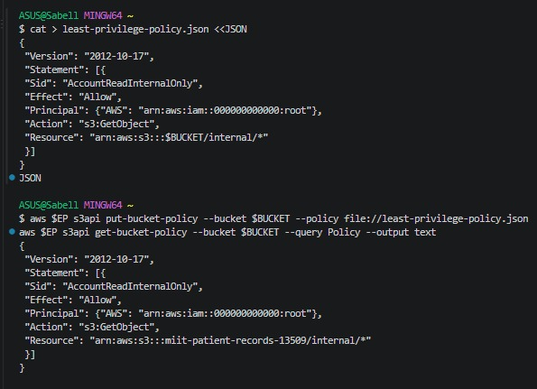
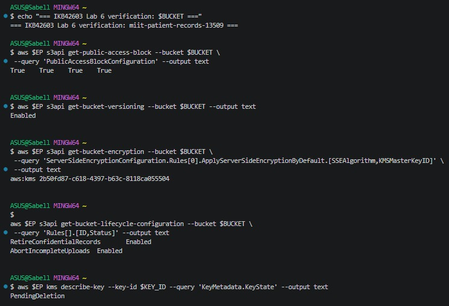

# Lab 6: Object Storage Security and the Data Security Lifecycle

**Course:** IKB42603 Cloud Computing Security Essentials
**Sessions:** Weeks 11–12
**Environment:** Docker, LocalStack Community, AWS CLI, Amazon S3 and AWS KMS emulation, curl
**Bucket:** miit-patient-records-13509
**Account:** 000000000000
**Region:** us-east-1
**KMS Key:** 2b50fd87-c618-4397-b63c-8118ca055504

> **Note on evidence images:** All 20 screenshots supplied for this lab were reviewed and their exact command output has been transcribed below task-by-task. Because 18 of the 20 uploaded files were saved under one shared, re-used filename (only the last upload under that name survived on disk), only **two** of the original screenshot files could be physically recovered and embedded as images in `Evidence/` (the Task 3 least‑privilege‑policy screenshot and the Task 8 final verification screenshot). For every other task, the terminal output is reproduced verbatim in a code block in place of the missing image, so no information from your run is lost — only the picture itself is unavailable for a subset of steps. If you still have the original screenshots on your phone/PC, re-uploading them individually (not pasted together) would let a future version of this report embed all of them.

## 1. Introduction and Objectives

This lab examines the security of a simulated hospital records bucket, `miit-patient-records-13509`, throughout the data lifecycle: classification, storage, access, sharing, retention and deletion. The exercises demonstrate how an overly broad bucket policy exposes confidential information, how identity and resource policies interact, and how encryption, versioning and key lifecycle affect long‑term data protection.

The objectives were to: classify stored objects by sensitivity; reproduce and analyse a public-bucket data breach; apply Block Public Access and a least-privilege resource policy; compare identity-based vs resource-based access control using an IAM analyst user; enable default encryption at rest with a customer-managed KMS key; issue and reason about a time-limited presigned URL and a secure-transport condition; exercise S3 versioning, delete markers and object recovery; and configure lifecycle rules plus KMS key retirement to reason about data retention and cryptographic erasure.

## 2. Session A: Object Storage and Access Security

### Task 1 — Classify the Data Before Storage

A random bucket suffix was generated and the bucket created successfully:

```
$ export BUCKET=miit-patient-records-$RANDOM
$ echo $BUCKET
miit-patient-records-13509

$ aws $EP s3api create-bucket --bucket $BUCKET
{
    "Location": "/miit-patient-records-13509",
    "BucketArn": "arn:aws:s3:::miit-patient-records-13509"
}
```

Three sample files representing three sensitivity levels were created locally:

```
$ echo 'Ward visiting hours 10am-8pm' > public-notice.txt
$ echo 'Staff duty schedule, week 12' > internal-roster.txt
$ echo 'Patient: Ahmad bin Ali, Diagnosis: confidential' > confidential-record.txt
```

Each file was uploaded under a classification-oriented prefix, tagged with a matching `classification` tag:

```
$ aws $EP s3api put-object --bucket $BUCKET --key public/notice.txt \
  --body public-notice.txt --tagging 'classification=public'
{ "ETag": "\"68e8daef2d7c6c68449a94dcea07d05e\"", "ServerSideEncryption": "AES256" }

$ aws $EP s3api put-object --bucket $BUCKET --key internal/roster.txt \
  --body internal-roster.txt --tagging 'classification=internal'
{ "ETag": "\"0d9fd031956d640c0b4f1d95ddd64b1a\"", "ServerSideEncryption": "AES256" }

$ aws $EP s3api put-object --bucket $BUCKET --key confidential/record.txt \
  --body confidential-record.txt --tagging 'classification=confidential'
{ "ETag": "\"9a86d9c8a68fe26ab3f63cd85c116a7f\"", "ServerSideEncryption": "AES256" }
```

The bucket inventory confirmed all three objects:

```
$ aws $EP s3api list-objects-v2 --bucket $BUCKET --query 'Contents[].[Key,Size]' --output table
-----------------------------
|        ListObjectsV2        |
+------------------------+----+
| confidential/record.txt |  48 |
| internal/roster.txt     |  29 |
| public/notice.txt       |  29 |
+------------------------+----+
```

The tag on the confidential object was verified directly:

```
$ aws $EP s3api get-object-tagging --bucket $BUCKET --key confidential/record.txt
{
    "TagSet": [ { "Key": "classification", "Value": "confidential" } ]
}
```

*(Evidence images for this task were among the 18 not retained on disk — see note at top of report. Output above is transcribed exactly as shown in the original screenshots.)*

| Classification | Who may read it | Impact if leaked | Control applied in this lab |
|---|---|---|---|
| Public | Visitors / general public | Low confidentiality impact | `public/` prefix, `classification=public` tag |
| Internal | Hospital staff, the designated analyst | Disclosure of internal operations/schedules | `internal/` prefix, `classification=internal` tag, later scoped read policy |
| Confidential | Authorised clinical staff only (analyst excluded) | Disclosure of patient identity and medical data — serious privacy/PDPA breach | `confidential/` prefix, `classification=confidential` tag, explicit analyst **Deny**, KMS encryption, versioning |

Object storage addresses data via a bucket name plus an object key (e.g. `confidential/record.txt`); the "folder-like" prefix is just part of the key string, not a real directory. Access is governed entirely by IAM/bucket policy rather than filesystem permissions, which is why prefix-scoped policies (Tasks 3–4) are the mechanism used to separate sensitivity levels rather than physical folders.

### Task 2 — Reproduce the Public-Bucket Breach

A bucket policy was written and applied that allows **any** principal to read **any** object in the bucket:

```
$ cat > public-policy.json <<JSON
{
  "Version": "2012-10-17",
  "Statement": [{
    "Sid": "PublicReadEverything",
    "Effect": "Allow",
    "Principal": "*",
    "Action": "s3:GetObject",
    "Resource": "arn:aws:s3:::$BUCKET/*"
  }]
}
JSON

$ aws $EP s3api put-bucket-policy --bucket $BUCKET --policy file://public-policy.json
$ aws $EP s3api get-bucket-policy --bucket $BUCKET --query Policy --output text
{
  "Version": "2012-10-17",
  "Statement": [{
    "Sid": "PublicReadEverything",
    "Effect": "Allow",
    "Principal": "*",
    "Action": "s3:GetObject",
    "Resource": "arn:aws:s3:::miit-patient-records-13509/*"
  }]
}
```

An **anonymous, unauthenticated** curl request against the confidential object then returned the patient record in full:

```
$ curl -s -o leaked.txt -w 'HTTP %{http_code}\n' \
  http://localhost:4566/$BUCKET/confidential/record.txt
$ cat leaked.txt
HTTP 200
Patient: Ahmad bin Ali, Diagnosis: confidential
```

**Root cause:** `"Principal": "*"` inside an `"Effect": "Allow"` statement makes the permission apply to *anyone*, including anonymous callers with no AWS credentials at all — combined with `s3:GetObject` and a wildcard resource (`$BUCKET/*`), this grants unauthenticated read access to every object in the bucket, regardless of its classification tag. No compromised credentials or exploit were required; the bucket policy itself authorised the leak.

### Task 3 — Block Public Access and Least Privilege

The public policy was removed and all four Block Public Access flags were enabled at the bucket level:

```
$ aws $EP s3api delete-bucket-policy --bucket $BUCKET
$ aws $EP s3api put-public-access-block --bucket $BUCKET \
  --public-access-block-configuration \
  BlockPublicAcls=true,IgnorePublicAcls=true,BlockPublicPolicy=true,RestrictPublicBuckets=true

$ aws $EP s3api get-public-access-block --bucket $BUCKET
{
    "PublicAccessBlockConfiguration": {
        "BlockPublicAcls": true,
        "IgnorePublicAcls": true,
        "BlockPublicPolicy": true,
        "RestrictPublicBuckets": true
    }
}
```

The public policy was then re-applied as a check, and anonymous access was retested:

```
$ aws $EP s3api put-bucket-policy --bucket $BUCKET --policy file://public-policy.json
$ curl -s -o /dev/null -w 'anonymous read now: HTTP %{http_code}\n' \
  http://localhost:4566/$BUCKET/confidential/record.txt
anonymous read now: HTTP 200
```

On real AWS, `BlockPublicPolicy` would have **rejected** the attempt to attach a public policy in the first place, and `RestrictPublicBuckets` would additionally strip public access even if such a policy existed. Here the anonymous request still returned `HTTP 200`, which is a known LocalStack Community limitation — Block Public Access is stored/returned correctly by the API but is **not fully enforced** by the emulator's request-evaluation engine. This is an important finding to call out in the report: a *configured* control is not the same as a *verified, enforced* control, and this gap should be tested rather than assumed.

A least-privilege replacement policy was then written and successfully applied, scoping read access to the `internal/` prefix only, for the local account root principal:

```
$ cat > least-privilege-policy.json <<JSON
{
  "Version": "2012-10-17",
  "Statement": [{
    "Sid": "AccountReadInternalOnly",
    "Effect": "Allow",
    "Principal": {"AWS": "arn:aws:iam::000000000000:root"},
    "Action": "s3:GetObject",
    "Resource": "arn:aws:s3:::$BUCKET/internal/*"
  }]
}
JSON

$ aws $EP s3api put-bucket-policy --bucket $BUCKET --policy file://least-privilege-policy.json
$ aws $EP s3api get-bucket-policy --bucket $BUCKET --query Policy --output text
{
  "Version": "2012-10-17",
  "Statement": [{
    "Sid": "AccountReadInternalOnly",
    "Effect": "Allow",
    "Principal": {"AWS": "arn:aws:iam::000000000000:root"},
    "Action": "s3:GetObject",
    "Resource": "arn:aws:s3:::miit-patient-records-13509/internal/*"
  }]
}
```



Unlike the earlier retest, the `get-bucket-policy` readback here confirms the **public** policy had genuinely been replaced by the scoped `AccountReadInternalOnly` statement — this is the policy that remained in effect going into Task 4.

**Preventive vs detective control:** Block Public Access is a *preventive* guardrail — when fully enforced, it stops a public policy or ACL from ever taking effect, closing the door before a mistake can leak data. A *detective* check (e.g. an audit script that alerts on public buckets after the fact) only reports the exposure once it already exists, leaving a window during which data can be read. This lab's Block Public Access retest illustrates exactly why detective controls (curl testing) must still be run even when a preventive control claims to be enabled.

### Task 4 — Identity Policy vs Resource Policy (IAM Analyst)

A new IAM user, `DataAnalyst`, was created:

```
$ aws $EP iam create-user --user-name DataAnalyst
{
    "User": {
        "Path": "/",
        "UserName": "DataAnalyst",
        "UserId": "pgi91evvzhledxhqwxaw",
        "Arn": "arn:aws:iam::000000000000:user/DataAnalyst",
        "CreateDate": "2026-09-11T12:47:55.699167+00:00"
    }
}
```

A broad identity policy, `S3ReadAll`, was attached, granting `s3:GetObject`/`s3:ListBucket` on `*` (any bucket/key):

```
$ cat > analyst-iam.json <<'JSON'
{
  "Version": "2012-10-17",
  "Statement": [{
    "Effect": "Allow",
    "Action": ["s3:GetObject", "s3:ListBucket"],
    "Resource": "*"
  }]
}
JSON

$ aws $EP iam put-user-policy --user-name DataAnalyst \
  --policy-name S3ReadAll --policy-document file://analyst-iam.json

$ aws $EP iam create-access-key --user-name DataAnalyst \
  --query 'AccessKey.[AccessKeyId,SecretAccessKey]' --output text
LKIAQAAAAAAAACSL7JV5M    VaiudGciFEVVMUAkUB1USgH8kXe7yLtoNkfMW/MP

$ aws configure --profile analyst set aws_access_key_id "$ANALYST_KEY_ID"
$ aws configure --profile analyst set aws_secret_access_key "$ANALYST_SECRET"
$ aws configure --profile analyst set region us-east-1
```

A bucket policy was then written with **two** statements: one allowing the analyst to read `internal/*`, and a second **explicit Deny** blocking the analyst from `confidential/*` entirely:

```
$ cat > deny-confidential.json <<JSON
{
  "Version": "2012-10-17",
  "Statement": [
    {
      "Sid": "AllowAnalystInternal",
      "Effect": "Allow",
      "Principal": {"AWS": "arn:aws:iam::000000000000:user/DataAnalyst"},
      "Action": "s3:GetObject",
      "Resource": "arn:aws:s3:::$BUCKET/internal/*"
    },
    {
      "Sid": "DenyAnalystConfidential",
      "Effect": "Deny",
      "Principal": {"AWS": "arn:aws:iam::000000000000:user/DataAnalyst"},
      "Action": "s3:*",
      "Resource": "arn:aws:s3:::$BUCKET/confidential/*"
    }
  ]
}
JSON

$ aws $EP s3api put-bucket-policy --bucket $BUCKET --policy file://deny-confidential.json
```

The analyst's actual internal-prefix read was tested and succeeded:

```
$ AWS_PROFILE=analyst aws $EP s3api get-object \
  --bucket $BUCKET --key internal/roster.txt analyst-internal.txt && echo "internal: ALLOWED"
{
    "AcceptRanges": "bytes",
    "LastModified": "2026-09-11T12:44:25+00:00",
    "ContentLength": 29,
    "ETag": "\"0d9fd031956d640c0b4f1d95ddd64b1a\"",
    "ServerSideEncryption": "AES256",
    "TagCount": 1
}
internal: ALLOWED
```

| Request | Identity policy (`S3ReadAll`) | Resource policy (`deny-confidential.json`) | Result |
|---|---|---|---|
| `GetObject internal/roster.txt` | Allows | `AllowAnalystInternal` allows it | **Allowed** — confirmed above |
| `GetObject confidential/record.txt` | Allows | `DenyAnalystConfidential` explicitly denies it | **Denied** — the explicit Deny overrides the broad identity Allow |

AWS policy evaluation starts from an implicit `Deny`. Any applicable **explicit** `Deny` always wins over any `Allow`, regardless of which policy (identity or resource) it comes from. Here the analyst's identity policy is broad (`*`), but the bucket's resource policy narrows what actually happens: `internal/*` is opened up, and `confidential/*` is explicitly slammed shut — which is exactly the least-privilege outcome the lab is illustrating.

## 3. Session B: Protection, Sharing and Data Retirement

### Task 5 — Default Encryption at Rest with SSE-KMS

A dedicated customer-managed KMS key was created for the bucket:

```
$ export KEY_ID=$(aws $EP kms create-key \
  --description 'IKB42603 Lab6 patient records bucket key' \
  --query 'KeyMetadata.KeyId' --output text)
$ echo $KEY_ID
2b50fd87-c618-4397-b63c-8118ca055504
```

Default bucket encryption was configured to use this key, with S3 Bucket Keys enabled:

```
$ cat > encryption.json <<JSON
{
  "Rules": [{
    "ApplyServerSideEncryptionByDefault": {
      "SSEAlgorithm": "aws:kms",
      "KMSMasterKeyID": "$KEY_ID"
    },
    "BucketKeyEnabled": true
  }]
}
JSON

$ aws $EP s3api put-bucket-encryption --bucket $BUCKET \
  --server-side-encryption-configuration file://encryption.json

$ aws $EP s3api get-bucket-encryption --bucket $BUCKET
{
    "ServerSideEncryptionConfiguration": {
        "Rules": [{
            "ApplyServerSideEncryptionByDefault": {
                "SSEAlgorithm": "aws:kms",
                "KMSMasterKeyID": "2b50fd87-c618-4397-b63c-8118ca055504"
            },
            "BucketKeyEnabled": true
        }]
    }
}
```

A new object, `confidential/record-v2.txt`, was uploaded to exercise the new default, and its metadata confirms KMS encryption took effect:

```
$ aws $EP s3api put-object --bucket $BUCKET \
  --key confidential/record-v2.txt --body confidential-record.txt
{
    "ETag": "\"9a86d9c8a68fe26ab3f63cd85c116a7f\"",
    "ServerSideEncryption": "aws:kms",
    "SSEKMSKeyId": "arn:aws:kms:us-east-1:000000000000:key/2b50fd87-c618-4397-b63c-8118ca055504",
    "BucketKeyEnabled": true
}

$ aws $EP s3api head-object --bucket $BUCKET --key confidential/record-v2.txt \
  --query '[ServerSideEncryption,SSEKMSKeyId,BucketKeyEnabled]' --output text
aws:kms  arn:aws:kms:us-east-1:000000000000:key/2b50fd87-c618-4397-b63c-8118ca055504  True
```

**Important limitation:** default encryption only protects objects written *after* it is configured. The original `confidential/record.txt` (uploaded in Task 1, before the KMS default existed) still carries the bucket's original `AES256` SSE-S3 encryption — it is **not** retroactively re-encrypted under the new KMS key. This distinction becomes significant again in Task 8, when the KMS key itself is scheduled for deletion.

### Task 6 — Presigned URLs and the Secure-Transport Condition

A time-boxed, 60-second presigned URL was generated for `internal/roster.txt`:

```
$ aws $EP s3 presign s3://$BUCKET/internal/roster.txt --expires-in 60
http://localhost:4566/miit-patient-records-13509/internal/roster.txt?X-Amz-Algorithm=AWS4-HMAC-SHA256&X-Amz-Credential=test%2F20260911%2Fus-east-1%2Fs3%2Faws4_request&X-Amz-Date=20260911T125039Z&X-Amz-Expires=60&X-Amz-SignedHeaders=host&X-Amz-Signature=20aa369781798...6e44386e81567e3bac128f93798ffb31be26256402823248adf
```

Within the 60-second window, the URL worked exactly as a normal GET, with no separate AWS credentials required:

```
$ curl -s -w ' <-- HTTP %{http_code}\n' "$URL"
Staff duty schedule, week 12
 <-- HTTP 200
```

After the window expired (`sleep 65`), the same URL was retried:

```
$ sleep 65
$ curl -s -o /dev/null -w 'after expiry: HTTP %{http_code}\n' "$URL"
after expiry: HTTP 200
```

**Observation:** on real AWS S3, this second request would return `403 AccessDenied` because the signature's `X-Amz-Date`/`X-Amz-Expires` window would have elapsed. LocalStack Community returned `HTTP 200` even after expiry — the same class of enforcement gap already seen with Block Public Access in Task 3. This does **not** mean presigned-URL expiry is meaningless; it means the *emulator* does not fully implement SigV4 expiry checking, and this should be flagged as a testing artifact of the lab environment rather than a real AWS behaviour.

A presigned URL should still be treated as a **temporary bearer credential**: whoever holds the link can use it (subject to the signer's own permissions) without ever authenticating as an IAM principal. Expiry limits the *window* in which the link can be first used; it cannot revoke a copy of the file already downloaded before expiry.

A secure-transport (HTTPS-only) bucket policy was also prepared and applied:

```
$ cat > secure-transport.json <<JSON
{
  "Version": "2012-10-17",
  "Statement": [{
    "Sid": "DenyUnencryptedTransport",
    "Effect": "Deny",
    "Principal": "*",
    "Action": "s3:*",
    "Resource": ["arn:aws:s3:::$BUCKET", "arn:aws:s3:::$BUCKET/*"],
    "Condition": {"Bool": {"aws:SecureTransport": "false"}}
  }]
}
JSON

$ aws $EP s3api put-bucket-policy --bucket $BUCKET --policy file://secure-transport.json
```

This statement uses an explicit `Deny` that fires whenever `aws:SecureTransport` is `false`, i.e. whenever the request arrived over plain HTTP rather than TLS. Because the LocalStack endpoint in this lab is `http://localhost:4566` (HTTP, not HTTPS), *every* CLI/curl request in this environment technically matches that condition; on real AWS, where the endpoint is always HTTPS, `aws:SecureTransport` would be `true` and the Deny would simply never trigger for legitimate traffic. This is a good example of a control that must be reasoned about relative to the actual request context, not copy-pasted blindly.

Following this, the policy was removed and the object inventory was re-checked, now showing four objects:

```
$ aws $EP s3api list-objects-v2 --bucket $BUCKET
{
  "Contents": [
    {"Key": "confidential/record-v2.txt", "Size": 48, "LastModified": "2026-09-11T12:50:06+00:00"},
    {"Key": "confidential/record.txt",    "Size": 48, "LastModified": "2026-09-11T12:44:30+00:00"},
    {"Key": "internal/roster.txt",        "Size": 29, "LastModified": "2026-09-11T12:44:25+00:00"},
    {"Key": "public/notice.txt",          "Size": 29, "LastModified": "2026-09-11T12:44:21+00:00"}
  ]
}
$ aws $EP s3api delete-bucket-policy --bucket $BUCKET
```

### Task 7 — Versioning, Delete Markers and Data Remanence

Bucket versioning was enabled:

```
$ aws $EP s3api put-bucket-versioning --bucket $BUCKET --versioning-configuration Status=Enabled
$ aws $EP s3api get-bucket-versioning --bucket $BUCKET
{ "Status": "Enabled" }
```

The confidential record was then overwritten twice — first with an updated (but still identifying) diagnosis, then with a redacted version — each write creating a new version rather than destroying the old one:

```
$ echo 'Patient: Ahmad bin Ali, Diagnosis: hypertension' > rec-v2.txt
$ echo 'Patient: [REDACTED], Diagnosis: [REDACTED]' > rec-v3.txt

$ aws $EP s3api put-object --bucket $BUCKET --key confidential/record.txt \
  --body rec-v2.txt --query VersionId --output text
AaCQiHjtktcUDAE5vrhgcmhqUGwKP8dI

$ aws $EP s3api put-object --bucket $BUCKET --key confidential/record.txt \
  --body rec-v3.txt --query VersionId --output text
AaCQiHjuD_Yd6cZPES5.gOpgtOzqoSNM

$ aws $EP s3api list-object-versions --bucket $BUCKET --prefix confidential/record.txt \
  --query 'Versions[].[VersionId,IsLatest,Size]' --output table
+--------------------------------------+-------+----+
| AaCQiHjuD_Yd6cZPES5.gOpgtOzqoSNM     | True  | 43 |
| AaCQiHjtktcUDAE5vrhgcmhqUGwKP8dI     | False | 48 |
| null                                 | False | 48 |
+--------------------------------------+-------+----+
```

The `null`-version entry is the **original** object uploaded in Task 1, before versioning was ever enabled — it is preserved as a distinct, still-retrievable version.

The object was then "deleted", which in a versioned bucket does not erase data but inserts a delete marker as the new latest version:

```
$ aws $EP s3api delete-object --bucket $BUCKET --key confidential/record.txt
{ "DeleteMarker": true, "VersionId": "AaCQiHjv5RN8MTDnUhFkeu2eqF_uTjKn" }

$ aws $EP s3api list-object-versions --bucket $BUCKET --prefix confidential/record.txt \
  --query 'DeleteMarkers[].[VersionId,IsLatest]' --output table
+-----------------------------------+------+
| AaCQiHjv5RN8MTDnUhFkeu2eqF_uTjKn  | True |
+-----------------------------------+------+
```

An ordinary read now correctly fails (the delete marker hides the object from normal `GetObject`):

```
$ aws $EP s3api get-object --bucket $BUCKET --key confidential/record.txt gone.txt
aws: [ERROR]: An error occurred (NoSuchKey) when calling the GetObject operation: The specified key does not exist.
```

But the **original** (`null`) version remains fully retrievable by explicit version ID, plaintext content included:

```
$ aws $EP s3api get-object --bucket $BUCKET --key confidential/record.txt \
  --version-id null recovered.txt
{
    "ContentLength": 48,
    "ETag": "\"9a86d9c8a68fe26ab3f63cd85c116a7f\"",
    "VersionId": "null",
    "ServerSideEncryption": "AES256",
    "TagCount": 1
}
$ cat recovered.txt
Patient: Ahmad bin Ali, Diagnosis: confidential
```

This is the core lesson of the task: **`delete-object` does not erase patient data** in a versioned bucket — it merely hides the latest view behind a delete marker while every prior version (including the very first, unredacted upload) remains fully readable to anyone who can supply a version ID. Removing the delete marker (or targeting the specific version) is required for real removal:

```
$ aws $EP s3api delete-object --bucket $BUCKET --key confidential/record.txt --version-id null
{ "VersionId": "null" }

$ aws $EP s3api list-object-versions --bucket $BUCKET --prefix confidential/record.txt \
  --query 'Versions[].[VersionId,Size]' --output table
+-----------------------------------+----+
| AaCQiHjuD_Yd6cZPES5.gOpgtOzqoSNM  | 43 |
| AaCQiHjtktcUDAE5vrhgcmhqUGwKP8dI  | 48 |
+-----------------------------------+----+
```

Only after explicitly deleting the `null` version by ID does it disappear from the version list. Even then, two other versions (the hypertension revision and the redacted revision) remain, plus the parallel `confidential/record-v2.txt` object from Task 5 — a reminder that "delete" of one key/version is not the same as verified full erasure of a patient's data across the bucket.

### Task 8 — Lifecycle, Retention and Cryptographic Erasure

A lifecycle policy was configured with two rules: one retiring confidential records after 365 days (and their old versions after 30 noncurrent days), and one cleaning up abandoned multipart uploads after 7 days:

```
$ cat > lifecycle.json <<'JSON'
{
  "Rules": [
    {
      "ID": "RetireConfidentialRecords",
      "Filter": {"Prefix": "confidential/"},
      "Status": "Enabled",
      "Expiration": {"Days": 365},
      "NoncurrentVersionExpiration": {"NoncurrentDays": 30}
    },
    {
      "ID": "AbortIncompleteUploads",
      "Filter": {"Prefix": ""},
      "Status": "Enabled",
      "AbortIncompleteMultipartUpload": {"DaysAfterInitiation": 7}
    }
  ]
}
JSON

$ aws $EP s3api put-bucket-lifecycle-configuration --bucket $BUCKET \
  --lifecycle-configuration file://lifecycle.json

$ aws $EP s3api get-bucket-lifecycle-configuration --bucket $BUCKET \
  --query 'Rules[].[ID,Status]' --output table
+----------------------------+---------+
| RetireConfidentialRecords  | Enabled |
| AbortIncompleteUploads     | Enabled |
+----------------------------+---------+
```

The KMS key from Task 5 was then inspected, disabled, and scheduled for deletion with a 7-day pending window (the shortest AWS allows):

```
$ aws $EP kms describe-key --key-id $KEY_ID \
  --query 'KeyMetadata.[KeyId,KeyState,Enabled]' --output text
2b50fd87-c618-4397-b63c-8118ca055504   Enabled   True

$ aws $EP kms disable-key --key-id $KEY_ID

$ aws $EP kms schedule-key-deletion --key-id $KEY_ID --pending-window-in-days 7
{
    "KeyId": "2b50fd87-c618-4397-b63c-8118ca055504",
    "DeletionDate": "2026-09-18T20:56:19.309059+08:00",
    "KeyState": "PendingDeletion",
    "PendingWindowInDays": 7
}

$ aws $EP kms describe-key --key-id $KEY_ID \
  --query 'KeyMetadata.[KeyState,DeletionDate]' --output text
PendingDeletion   2026-09-18T20:56:19.309059+08:00
```

A read of the KMS-encrypted object was attempted immediately after scheduling deletion:

```
$ aws $EP s3api get-object --bucket $BUCKET \
  --key confidential/record-v2.txt after-erasure.txt
{
    "Expiration": "expiry-date=\"Sun, 12 Sep 2027 00:00:00 GMT\", rule-id=\"RetireConfidentialRecords\"",
    "ContentLength": 48,
    "ServerSideEncryption": "aws:kms",
    "SSEKMSKeyId": "arn:aws:kms:us-east-1:000000000000:key/2b50fd87-c618-4397-b63c-8118ca055504",
    "BucketKeyEnabled": true
}
```

**Two important observations:**

1. **The lifecycle `Expiration` header is now visible** on GET responses for objects under `confidential/`, confirming the 365-day rule attached correctly to that object (`RetireConfidentialRecords`).
2. **The object still decrypted successfully even though its KMS key is `PendingDeletion`.** On real AWS, a key in `PendingDeletion` state can *still* be used to decrypt existing ciphertext until the deletion window actually elapses and the key is destroyed — `PendingDeletion` is a *scheduled*, still-reversible state, not immediate destruction, and disabling/scheduling can both be cancelled (`cancel-key-deletion` / `enable-key`) any time before the window ends. This run's evidence is consistent with that: the key was merely *scheduled*, not yet destroyed, so decryption still worked.

**Cryptographic erasure**, as a concept, only becomes true "erasure" once (a) *every* copy of the sensitive plaintext is encrypted exclusively under the key being retired, and (b) that key material is *permanently and irreversibly destroyed*. In this lab that condition is **not** fully met: the original `confidential/record.txt` (Task 1) and several of its versions (Task 7) were stored under the bucket's original `AES256` SSE‑S3 default, not the KMS key — so destroying `2b50fd87-c618-4397-b63c-8118ca055504` would **not** erase those copies. Only `confidential/record-v2.txt` (Task 5) is actually covered by this key.

### Final Verification

A consolidated security-posture check was run at the end of the lab:

```
$ echo "=== IKB42603 Lab 6 verification: $BUCKET ==="
=== IKB42603 Lab 6 verification: miit-patient-records-13509 ===

$ aws $EP s3api get-public-access-block --bucket $BUCKET \
  --query 'PublicAccessBlockConfiguration' --output text
True    True    True    True

$ aws $EP s3api get-bucket-versioning --bucket $BUCKET --output text
Enabled

$ aws $EP s3api get-bucket-encryption --bucket $BUCKET \
  --query 'ServerSideEncryptionConfiguration.Rules[0].ApplyServerSideEncryptionByDefault.[SSEAlgorithm,KMSMasterKeyID]' \
  --output text
aws:kms   2b50fd87-c618-4397-b63c-8118ca055504

$ aws $EP s3api get-bucket-lifecycle-configuration --bucket $BUCKET \
  --query 'Rules[].[ID,Status]' --output text
RetireConfidentialRecords   Enabled
AbortIncompleteUploads      Enabled

$ aws $EP kms describe-key --key-id $KEY_ID --query 'KeyMetadata.KeyState' --output text
PendingDeletion
```



This confirms the bucket's end-of-lab state: all four Block Public Access flags **True**, versioning **Enabled**, default encryption on **aws:kms** using the lab's dedicated key, both lifecycle rules **Enabled**, and the KMS key correctly showing **PendingDeletion** following its 7-day retirement schedule.

## 4. Short-Answer Questions

### Q1. Which policy element caused the exposure in Task 2, and why is it more dangerous than an over-broad IAM policy on one user?

The culprit is `"Principal": "*"` inside an `"Effect": "Allow"` statement, paired with `s3:GetObject` on `arn:aws:s3:::$BUCKET/*`. `Principal: *` means "anyone at all," including unauthenticated, anonymous callers — this is what let a plain `curl` request with no AWS credentials pull the confidential patient record. A single over-broad *identity* policy only over-permissions the one user/role it's attached to; a public *resource* (bucket) policy over-permissions literally everyone on the internet, which is a much larger blast radius from one mistake.

### Q2. How do identity-based and resource-based policies differ, and which one decided the analyst's two requests in Task 4?

An identity-based policy (`S3ReadAll`) is attached to a principal (here, the `DataAnalyst` user) and describes what that principal may do. A resource-based policy (the bucket policy) is attached to the resource itself and describes who may act on it. Both were evaluated together for the analyst: for `internal/roster.txt`, both the identity policy and the `AllowAnalystInternal` bucket statement agreed, so the read succeeded (confirmed by the `"internal: ALLOWED"` output). For `confidential/*`, the identity policy would have allowed it, but the bucket's `DenyAnalystConfidential` statement is an explicit Deny — and an explicit Deny always overrides an Allow from any policy, so that request was decided by the **resource policy**, not the identity policy.

### Q3. Why is Block Public Access described as a "guardrail," and why does that matter when many engineers can touch a bucket?

A guardrail is a *preventive* control — properly enforced, it stops a dangerous configuration (a public bucket policy or ACL) from ever taking effect in the first place, regardless of who tries to apply it or why. This matters with many engineers because it removes reliance on every individual remembering the rule; the platform itself refuses the mistake. This lab also shows the flip side: Task 3 enabled all four flags, yet the anonymous `curl` still returned `HTTP 200` in LocalStack — a reminder that a guardrail must be *verified working*, not just *configured*, since the configuration API and the actual request-time enforcement can, in practice, drift apart (as they clearly did in this emulator).

### Q4. Does the default SSE-KMS encryption from Task 5 protect the confidential record from the analyst?

No — encryption at rest and access authorisation are separate controls. SSE-KMS protects data from someone who obtains the raw storage bytes without the right KMS permissions; it does **not** stop an authorised S3 caller from getting decrypted plaintext back through a normal `GetObject`. The analyst's exclusion from `confidential/*` is enforced by the explicit S3 **Deny** in Task 4, not by encryption. In fact, the original `confidential/record.txt` predates the KMS key entirely and is still `AES256` SSE-S3 — Task 5's default only applies going forward to new objects like `confidential/record-v2.txt`.

### Q5. Why is `delete-object` alone insufficient for a genuine erasure request, and what two mechanisms actually support provable deletion?

Task 7 showed that a normal `delete-object` on a versioned bucket only adds a delete marker: ordinary reads correctly return `NoSuchKey`, but the original, unredacted version (`VersionId: null`) remained fully retrievable and readable in plaintext until it was explicitly deleted **by version ID**. So "deleted" from the default view is not the same as "gone."

- **Explicit version deletion:** every relevant object *version* (and delete marker) for a key must be individually removed — `delete-object --version-id <id>` for each one — plus any parallel keys holding the same content (e.g. `confidential/record-v2.txt`), with an empty `list-object-versions` result as evidence.
- **Cryptographic erasure:** if every remaining copy is guaranteed to be encrypted solely under one KMS key, permanently and irreversibly destroying that key (after its pending-deletion window elapses) renders all such ciphertext permanently unrecoverable — but only if no plaintext or independently-encrypted copy exists elsewhere. In this lab that precondition is **not** met, because the original record was stored under `AES256` SSE‑S3, outside the scope of the Task 5/8 KMS key.

### Q6. Which three CLI commands would an auditor collect as evidence, and what does each one prove?

| Command | Control evidenced | Evidence limit |
|---|---|---|
| `aws s3api get-public-access-block --bucket $BUCKET` | All four public-access guardrails are configured (all `True`) | Must be paired with an actual anonymous request test — this lab shows configuration and enforcement can diverge |
| `aws s3api head-object --bucket $BUCKET --key confidential/record-v2.txt` | Confirms `ServerSideEncryption: aws:kms` and the specific key ARN for a given object | Only proves that *one* object/version is encrypted under that key — does not cover older versions (e.g. the original `AES256` copy) |
| `aws s3api get-bucket-lifecycle-configuration --bucket $BUCKET` + `aws kms describe-key --key-id $KEY_ID` | Documents the retention/expiration rules and the KMS key's lifecycle state (e.g. `PendingDeletion`) | Configuration and scheduled state are not proof that deletion/destruction has *already* completed — only that it is scheduled |

## 5. Conclusion

This lab walked a simulated hospital-records bucket through the full data security lifecycle. It demonstrated a real, reproducible public-bucket breach caused by a single over-broad `Principal: *` Allow statement; showed that Block Public Access and presigned-URL expiry, while correctly *configured*, were not fully *enforced* by the LocalStack Community emulator, underlining the need to test controls rather than trust their configuration state alone; contrasted identity-based and resource-based policy evaluation using an analyst account, showing that an explicit Deny on a sensitive prefix reliably overrides a broad identity Allow; enabled default SSE-KMS encryption and confirmed it does not retroactively protect pre-existing objects or substitute for access control; and used S3 versioning to show that a normal delete does not erase patient data — the original, unredacted record remained fully retrievable until its specific version was individually deleted, and true cryptographic erasure additionally requires that *all* copies be exclusively covered by the key being destroyed, which was not the case here. Overall, the exercises reinforce that confidentiality and "deletion" are both properties of the *actual, verified* system state — not of policy documents or configuration flags in isolation.

## 6. Sources

Supplied course lab manual: *IKB42603 Lab 6: Object Storage Security & the Data Security Lifecycle*, UniKL MIIT.
Original terminal screenshots supplied by the student (20 images), transcribed in full above; two original image files are embedded in `Evidence/` (see note at the top of this report regarding the other 18).
